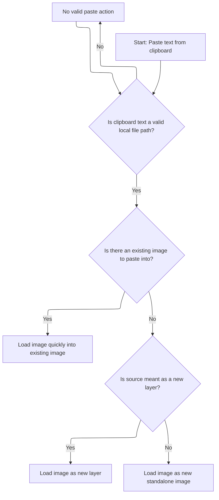

```mermaid
%%{init: {"flowchart": {"defaultRenderer": "elk"}} }%%
flowchart TD
    node1["Start: Attempt to download image from URL"] --> node2{"Download successful?"}
    click node1 openCode "Classes/pdClipboardMain.cls:1062:1065"
    node2 -->|"No"| node3["Show download failure message"]
    click node2 openCode "Classes/pdClipboardMain.cls:1108:1110"
    node3 --> node4["Return failure"]
    click node3 openCode "Classes/pdClipboardMain.cls:1108:1110"
    node2 -->|"Yes"| node5{"Paste to specific image?"}
    click node2 openCode "Classes/pdClipboardMain.cls:1068:1070"
    node5 -->|"Yes"| node6["Load image into specified image"]
    click node5 openCode "Classes/pdClipboardMain.cls:1078:1079"
    node6 --> node10{"Image load successful?"}
    click node6 openCode "Classes/pdClipboardMain.cls:1078:1079"
    node5 -->|"No"| node7{"Paste as layer?"}
    click node5 openCode "Classes/pdClipboardMain.cls:1080:1084"
    node7 -->|"Yes"| node8["Load image as new layer"]
    click node7 openCode "Classes/pdClipboardMain.cls:1081:1082"
    node7 -->|"No"| node9["Load image as new image"]
    click node7 openCode "Classes/pdClipboardMain.cls:1083:1084"
    node8 --> node10
    click node8 openCode "Classes/pdClipboardMain.cls:1081:1082"
    node9 --> node10
    click node9 openCode "Classes/pdClipboardMain.cls:1083:1084"
    node10 -->|"Yes"| node11["Check image active state"]
    click node10 openCode "Classes/pdClipboardMain.cls:1103:1105"
    node11 -->|"Active"| node12["Show success message"]
    click node11 openCode "Classes/pdClipboardMain.cls:1091:1093"
    node11 -->|"Not active"| node13["Show load failure message"]
    click node11 openCode "Classes/pdClipboardMain.cls:1094:1096"
    node12 --> node14["Return success"]
    click node12 openCode "Classes/pdClipboardMain.cls:1091:1093"
    node13 --> node14
    click node13 openCode "Classes/pdClipboardMain.cls:1094:1096"
    node14["End"]
classDef HeadingStyle fill:#777777,stroke:#333,stroke-width:2px;

%% Swimm:
%% %%{init: {"flowchart": {"defaultRenderer": "elk"}} }%%
%% flowchart TD
%%     node1["Start: Attempt to download image from URL"] --> node2{"Download successful?"}
%%     click node1 openCode "<SwmPath>[Classes/pdClipboardMain.cls](Classes/pdClipboardMain.cls)</SwmPath>:1062:1065"
%%     node2 -->|"No"| node3["Show download failure message"]
%%     click node2 openCode "<SwmPath>[Classes/pdClipboardMain.cls](Classes/pdClipboardMain.cls)</SwmPath>:1108:1110"
%%     node3 --> node4["Return failure"]
%%     click node3 openCode "<SwmPath>[Classes/pdClipboardMain.cls](Classes/pdClipboardMain.cls)</SwmPath>:1108:1110"
%%     node2 -->|"Yes"| node5{"Paste to specific image?"}
%%     click node2 openCode "<SwmPath>[Classes/pdClipboardMain.cls](Classes/pdClipboardMain.cls)</SwmPath>:1068:1070"
%%     node5 -->|"Yes"| node6["Load image into specified image"]
%%     click node5 openCode "<SwmPath>[Classes/pdClipboardMain.cls](Classes/pdClipboardMain.cls)</SwmPath>:1078:1079"
%%     node6 --> node10{"Image load successful?"}
%%     click node6 openCode "<SwmPath>[Classes/pdClipboardMain.cls](Classes/pdClipboardMain.cls)</SwmPath>:1078:1079"
%%     node5 -->|"No"| node7{"Paste as layer?"}
%%     click node5 openCode "<SwmPath>[Classes/pdClipboardMain.cls](Classes/pdClipboardMain.cls)</SwmPath>:1080:1084"
%%     node7 -->|"Yes"| node8["Load image as new layer"]
%%     click node7 openCode "<SwmPath>[Classes/pdClipboardMain.cls](Classes/pdClipboardMain.cls)</SwmPath>:1081:1082"
%%     node7 -->|"No"| node9["Load image as new image"]
%%     click node7 openCode "<SwmPath>[Classes/pdClipboardMain.cls](Classes/pdClipboardMain.cls)</SwmPath>:1083:1084"
%%     node8 --> node10
%%     click node8 openCode "<SwmPath>[Classes/pdClipboardMain.cls](Classes/pdClipboardMain.cls)</SwmPath>:1081:1082"
%%     node9 --> node10
%%     click node9 openCode "<SwmPath>[Classes/pdClipboardMain.cls](Classes/pdClipboardMain.cls)</SwmPath>:1083:1084"
%%     node10 -->|"Yes"| node11["Check image active state"]
%%     click node10 openCode "<SwmPath>[Classes/pdClipboardMain.cls](Classes/pdClipboardMain.cls)</SwmPath>:1103:1105"
%%     node11 -->|"Active"| node12["Show success message"]
%%     click node11 openCode "<SwmPath>[Classes/pdClipboardMain.cls](Classes/pdClipboardMain.cls)</SwmPath>:1091:1093"
%%     node11 -->|"Not active"| node13["Show load failure message"]
%%     click node11 openCode "<SwmPath>[Classes/pdClipboardMain.cls](Classes/pdClipboardMain.cls)</SwmPath>:1094:1096"
%%     node12 --> node14["Return success"]
%%     click node12 openCode "<SwmPath>[Classes/pdClipboardMain.cls](Classes/pdClipboardMain.cls)</SwmPath>:1091:1093"
%%     node13 --> node14
%%     click node13 openCode "<SwmPath>[Classes/pdClipboardMain.cls](Classes/pdClipboardMain.cls)</SwmPath>:1094:1096"
%%     node14["End"]
%% classDef HeadingStyle fill:#777777,stroke:#333,stroke-width:2px;
```

This document describes the clipboard paste flow, enabling users to paste images or layers from various clipboard formats. It prioritizes formats such as internal data, PNG, HTML, JPEG, file lists, and text. The flow handles downloading images from <SwmToken path="Classes/pdClipboardMain.cls" pos="1022:27:27" line-data="            &#39;Now we will test the text for various supportable types, starting with URLs">`URLs`</SwmToken>, loading local files, positioning pasted layers based on mouse or selection coordinates, updating the UI, and optionally switching to the <SwmToken path="Classes/pdClipboardMain.cls" pos="515:29:31" line-data="    &#39;If a paste operation was successful, switch the current tool to the layer move/resize tool,">`move/resize`</SwmToken> tool after pasting.



```mermaid
flowchart TD
 node1["Prioritizing Clipboard Content Formats for Pasting"]:::HeadingStyle
 node1 -->|"Text available"| node2["Interpreting Clipboard Text as Image Source"]:::HeadingStyle
 node2 -->|"URL or local file"| node3["Downloading and Loading Images from URLs"]:::HeadingStyle
 node1 -->|"Previous attempts failed"| node4["Try bitmap or metafile paste
(Finalizing Paste with Bitmap, Metafile Handling, and Layer Positioning)"]:::HeadingStyle
 node3 --> node4
 node4 --> node5["Position pasted layer and update UI
(Finalizing Paste with Bitmap, Metafile Handling, and Layer Positioning)"]:::HeadingStyle
 click node1 goToHeading "Prioritizing Clipboard Content Formats for Pasting"
 click node2 goToHeading "Interpreting Clipboard Text as Image Source"
 click node3 goToHeading "Downloading and Loading Images from URLs"
 click node4 goToHeading "Finalizing Paste with Bitmap, Metafile Handling, and Layer Positioning"
 click node5 goToHeading "Finalizing Paste with Bitmap, Metafile Handling, and Layer Positioning"
classDef HeadingStyle fill:#777777,stroke:#333,stroke-width:2px;

%% Swimm:
%% flowchart TD
%%  node1["Prioritizing Clipboard Content Formats for Pasting"]:::HeadingStyle
%%  node1 -->|"Text available"| node2["Interpreting Clipboard Text as Image Source"]:::HeadingStyle
%%  node2 -->|"URL or local file"| node3["Downloading and Loading Images from <SwmToken path="Classes/pdClipboardMain.cls" pos="1022:27:27" line-data="            &#39;Now we will test the text for various supportable types, starting with URLs">`URLs`</SwmToken>"]:::HeadingStyle
%%  node1 -->|"Previous attempts failed"| node4["Try bitmap or metafile paste
%% (Finalizing Paste with Bitmap, Metafile Handling, and Layer Positioning)"]:::HeadingStyle
%%  node3 --> node4
%%  node4 --> node5["Position pasted layer and update UI
%% (Finalizing Paste with Bitmap, Metafile Handling, and Layer Positioning)"]:::HeadingStyle
%%  click node1 goToHeading "Prioritizing Clipboard Content Formats for Pasting"
%%  click node2 goToHeading "Interpreting Clipboard Text as Image Source"
%%  click node3 goToHeading "Downloading and Loading Images from <SwmToken path="Classes/pdClipboardMain.cls" pos="1022:27:27" line-data="            &#39;Now we will test the text for various supportable types, starting with URLs">`URLs`</SwmToken>"
%%  click node4 goToHeading "Finalizing Paste with Bitmap, Metafile Handling, and Layer Positioning"
%%  click node5 goToHeading "Finalizing Paste with Bitmap, Metafile Handling, and Layer Positioning"
%% classDef HeadingStyle fill:#777777,stroke:#333,stroke-width:2px;
```

# Prioritizing Clipboard Content Formats for Pasting

<SwmSnippet path="/Classes/pdClipboardMain.cls" line="429">

---

<SwmToken path="Classes/pdClipboardMain.cls" pos="429:4:4" line-data="Friend Function ClipboardPaste(ByVal srcIsMeantAsLayer As Boolean, Optional ByRef pasteToThisDIBInstead As pdDIB = Nothing, Optional ByRef fullParamString As String = vbNullString) As Boolean">`ClipboardPaste`</SwmToken> opens the clipboard and checks formats in priority order, calling specialized paste functions. It calls <SwmToken path="Classes/pdClipboardMain.cls" pos="488:5:5" line-data="            pasteWasSuccessful = ClipboardPaste_TextSource(srcIsMeantAsLayer, pasteToThisDIBInstead)">`ClipboardPaste_TextSource`</SwmToken> to handle text content after other formats fail.

```apex
Friend Function ClipboardPaste(ByVal srcIsMeantAsLayer As Boolean, Optional ByRef pasteToThisDIBInstead As pdDIB = Nothing, Optional ByRef fullParamString As String = vbNullString) As Boolean
    
    Dim pasteWasSuccessful As Boolean
    pasteWasSuccessful = False
    
    Dim cParams As pdSerialize
    Set cParams = New pdSerialize
    cParams.SetParamString fullParamString
    
    'Attempt to open the clipboard
    If m_Clipboard.ClipboardOpen(FormMain.hWnd) Then
        
        'Mark the clipboard as open; external functions can query this value
        m_IsClipboardOpen = True
        
        'When debugging, it's nice to know what clipboard formats the OS reports prior to actually retrieving them.
        PDDebug.LogAction "Clipboard reports the following formats: " & m_Clipboard.GetListOfAvailableFormatNames()
        
        'If PD was used to Cut or Copy something onto the clipboard, our own private format(s) will be listed first.
        If (m_Clipboard.DoesClipboardHaveFormatID(CF_PD_DIB) Or m_Clipboard.DoesClipboardHaveFormatID(CF_PD_LAYER)) And PD_CB_ALLOW_INTERNAL_FORMAT_PASTE Then
            pasteWasSuccessful = ClipboardPaste_InternalData(srcIsMeantAsLayer, pasteToThisDIBInstead)
        End If
        
        'PNGs on the clipboard get preferential treatment, as they preserve transparency data - so check for them first.
        If m_Clipboard.DoesClipboardHaveFormatName("PNG") And (Not pasteWasSuccessful) And PD_CB_ALLOW_PNG_PASTE Then
            pasteWasSuccessful = ClipboardPaste_CustomImageFormat("PNG", srcIsMeantAsLayer, "png", pasteToThisDIBInstead)
        End If
        
        'If we couldn't find PNG data (or something went horribly wrong during that step), look for an HTML fragment next.
        ' Images copied from web browsers typically create an HTML fragment, which should have a direct link to the copied image.
        '  Downloading the image manually lets us maintain things like ICC profiles and the image's original filename.
        If m_Clipboard.DoesClipboardHaveHTML() And (Not pasteWasSuccessful) And PD_CB_ALLOW_ONLINE_PASTE Then
            pasteWasSuccessful = ClipboardPaste_HTML(srcIsMeantAsLayer, pasteToThisDIBInstead)
        End If
        
        'JPEGs are another possibility.  We prefer them less than PNG or direct download (because there's no guarantee that the
        ' damn browser didn't re-encode them, but they're better than bitmaps or DIBs because they may retain metadata and
        ' color profiles, so test for JPEG next.  (Also, note that certain versions of Microsoft Office use "JFIF" as the identifier,
        ' for reasons known only to them...)
        If m_Clipboard.DoesClipboardHaveFormatName("JPEG") And (Not pasteWasSuccessful) And PD_CB_ALLOW_JPEG_PASTE Then
            pasteWasSuccessful = ClipboardPaste_CustomImageFormat("JPEG", srcIsMeantAsLayer, "jpg", pasteToThisDIBInstead)
        End If
        
        If m_Clipboard.DoesClipboardHaveFormatName("JPG") And (Not pasteWasSuccessful) And PD_CB_ALLOW_JPEG_PASTE Then
            pasteWasSuccessful = ClipboardPaste_CustomImageFormat("JPG", srcIsMeantAsLayer, "jpg", pasteToThisDIBInstead)
        End If
        
        If m_Clipboard.DoesClipboardHaveFormatName("JFIF") And (Not pasteWasSuccessful) And PD_CB_ALLOW_JPEG_PASTE Then
            pasteWasSuccessful = ClipboardPaste_CustomImageFormat("JFIF", srcIsMeantAsLayer, "jpg", pasteToThisDIBInstead)
        End If
        
        'Next, see if the clipboard contains a generic file list.  If it does, try to load each file in turn.
        If m_Clipboard.DoesClipboardHaveFiles() And (Not pasteWasSuccessful) And PD_CB_ALLOW_FILE_PASTE Then
            pasteWasSuccessful = ClipboardPaste_ListOfFiles(srcIsMeantAsLayer, pasteToThisDIBInstead)
        End If
        
        'Next, look for plaintext.  This could be a URL, or maybe a text representation of a filepath.
        ' (Also, note that we only have to search for one text format, because the OS auto-converts between text formats for free.)
        If m_Clipboard.DoesClipboardHaveText() And (Not pasteWasSuccessful) And PD_CB_ALLOW_GENERIC_TEXT_PASTE Then
            pasteWasSuccessful = ClipboardPaste_TextSource(srcIsMeantAsLayer, pasteToThisDIBInstead)
        End If
        
```

---

</SwmSnippet>

## Interpreting Clipboard Text as Image Source

```mermaid
%%{init: {"flowchart": {"defaultRenderer": "elk"}} }%%
flowchart TD
    node1{"Clipboard has text?"}
    node1 -->|"Yes"| node2{"Text is URL?"}
    node1 -->|"No"| node3["Return False - no text to paste"]
    node2 -->|"Yes"| node4["Downloading and Loading Images from URLs"]
    node2 -->|"No"| node5["Paste image from file path"]
    node5 --> node3
    node4 --> node3
classDef HeadingStyle fill:#777777,stroke:#333,stroke-width:2px;
click node4 goToHeading "Downloading and Loading Images from URLs"
node4:::HeadingStyle

%% Swimm:
%% %%{init: {"flowchart": {"defaultRenderer": "elk"}} }%%
%% flowchart TD
%%     node1{"Clipboard has text?"}
%%     node1 -->|"Yes"| node2{"Text is URL?"}
%%     node1 -->|"No"| node3["Return False - no text to paste"]
%%     node2 -->|"Yes"| node4["Downloading and Loading Images from <SwmToken path="Classes/pdClipboardMain.cls" pos="1022:27:27" line-data="            &#39;Now we will test the text for various supportable types, starting with URLs">`URLs`</SwmToken>"]
%%     node2 -->|"No"| node5["Paste image from file path"]
%%     node5 --> node3
%%     node4 --> node3
%% classDef HeadingStyle fill:#777777,stroke:#333,stroke-width:2px;
%% click node4 goToHeading "Downloading and Loading Images from <SwmToken path="Classes/pdClipboardMain.cls" pos="1022:27:27" line-data="            &#39;Now we will test the text for various supportable types, starting with URLs">`URLs`</SwmToken>"
%% node4:::HeadingStyle
```



<SwmSnippet path="/Classes/pdClipboardMain.cls" line="997">

---

In <SwmToken path="Classes/pdClipboardMain.cls" pos="997:4:4" line-data="Private Function ClipboardPaste_TextSource(ByVal srcIsMeantAsLayer As Boolean, Optional ByRef pasteToThisDIBInstead As pdDIB = Nothing) As Boolean">`ClipboardPaste_TextSource`</SwmToken>, the function first checks if clipboard text exists. It retrieves the text and trims surrounding quotes to handle Windows Explorer's 'Copy as path' behavior. Then it checks if the text starts with 'http' or 'ftp' to identify <SwmToken path="Classes/pdClipboardMain.cls" pos="1022:27:27" line-data="            &#39;Now we will test the text for various supportable types, starting with URLs">`URLs`</SwmToken>. If so, it calls <SwmToken path="Classes/pdClipboardMain.cls" pos="1025:5:5" line-data="                ClipboardPaste_TextSource = ClipboardPaste_WellFormedURL(clipText, srcIsMeantAsLayer)">`ClipboardPaste_WellFormedURL`</SwmToken> to download and load the image from the URL.

```apex
Private Function ClipboardPaste_TextSource(ByVal srcIsMeantAsLayer As Boolean, Optional ByRef pasteToThisDIBInstead As pdDIB = Nothing) As Boolean
    
    ClipboardPaste_TextSource = False
    
    'Make sure text actually exists on the clipboard
    If m_Clipboard.DoesClipboardHaveText() Then
        
        PDDebug.LogAction "ClipboardPaste_TextSource() will now parse clipboard text, looking for image sources..."
        
        'Text requires no special behavior on the part of external load functions, so we mark the module-level tracker as blank
        m_ClipboardInfo.pdci_CurrentFormat = 0
        m_ClipboardInfo.pdci_OriginalFormat = 0
        
        Dim clipText As String
        If m_Clipboard.GetClipboardText(clipText) Then
            
            'As reported by @manfromarce on GitHub (https://github.com/tannerhelland/PhotoDemon/discussions/421#discussioncomment-3476307)
            ' Windows Explorer provides a "Copy as path" context menu option that we should support - however, this option
            ' places double-quotes around the file path, which breaks our file path detector.
            
            'So look for and remove quotes around the target text, if any.
            clipText = Trim$(clipText)
            If (Left$(clipText, 1) = """") Then clipText = Right$(clipText, Len(clipText) - 1)
            If (Right$(clipText, 1) = """") Then clipText = Left$(clipText, Len(clipText) - 1)
            
            'Now we will test the text for various supportable types, starting with URLs
            If (Strings.StringsEqualLeft(clipText, "http", True) Or Strings.StringsEqualLeft(clipText, "ftp", True)) Then
                Message "Image URL found.  Attempting to download..."
                ClipboardPaste_TextSource = ClipboardPaste_WellFormedURL(clipText, srcIsMeantAsLayer)
                
```

---

</SwmSnippet>

### Downloading and Loading Images from <SwmToken path="Classes/pdClipboardMain.cls" pos="1022:27:27" line-data="            &#39;Now we will test the text for various supportable types, starting with URLs">`URLs`</SwmToken>



<SwmSnippet path="/Classes/pdClipboardMain.cls" line="1059">

---

In <SwmToken path="Classes/pdClipboardMain.cls" pos="1059:4:4" line-data="Private Function ClipboardPaste_WellFormedURL(ByVal srcURL As String, ByVal srcIsMeantAsLayer As Boolean, Optional ByVal suppressErrorMsgs As Boolean = False, Optional ByRef pasteToThisDIBInstead As pdDIB = Nothing) As Boolean">`ClipboardPaste_WellFormedURL`</SwmToken>, the function downloads the image from the URL to a temporary file. It then checks if the file is valid and calls <SwmToken path="Classes/pdClipboardMain.cls" pos="1084:5:5" line-data="                ClipboardPaste_WellFormedURL = LoadFileAsNewImage(tmpDownloadFile, tmpFilename, False, vbYes)">`LoadFileAsNewImage`</SwmToken> or layer loading functions depending on whether the image should be a new layer, a new image, or loaded into an existing DIB. It optionally shows messages about success or failure.

```apex
Private Function ClipboardPaste_WellFormedURL(ByVal srcURL As String, ByVal srcIsMeantAsLayer As Boolean, Optional ByVal suppressErrorMsgs As Boolean = False, Optional ByRef pasteToThisDIBInstead As pdDIB = Nothing) As Boolean
    
    'This function assumes the source URL is both absolute and well-formed
    Message "Image URL found.  Attempting to download..."
                    
    Dim tmpDownloadFile As String
    tmpDownloadFile = Web.DownloadURLToTempFile(srcURL, suppressErrorMsgs)
    
    'If the download was successful, we can now use the standard image load routine to import the temporary file
    If (Files.FileLenW(tmpDownloadFile) <> 0) Then
        
        'Additional file information variables, which we pass to the central load function to let it know that this is only a temp file,
        ' and it should use these hint values instead of assuming normal image load behavior.
        Dim tmpFilename As String
        tmpFilename = Files.FileGetName(tmpDownloadFile, True)
        
        'Depending on the request, load the clipboard data as a new image or as a new layer in the current image.
        ' (Note that we also suspend load errors, because if the URL was bad, the generic "clipboard doesn't have
        ' useable data" message covers all our bases here.)
        If (Not pasteToThisDIBInstead Is Nothing) Then
            ClipboardPaste_WellFormedURL = Loading.QuickLoadImageToDIB(tmpDownloadFile, pasteToThisDIBInstead, False, False)
        Else
            If (PDImages.IsImageActive() And srcIsMeantAsLayer) Then
                ClipboardPaste_WellFormedURL = Layers.LoadImageAsNewLayer(False, tmpDownloadFile, tmpFilename, False, False)
            Else
                ClipboardPaste_WellFormedURL = LoadFileAsNewImage(tmpDownloadFile, tmpFilename, False, vbYes)
            End If
        End If
        
```

---

</SwmSnippet>

<SwmSnippet path="/Modules/Loading.bas" line="64">

---

<SwmToken path="Modules/Loading.bas" pos="64:4:4" line-data="Public Function LoadFileAsNewImage(ByRef srcFile As String, Optional ByVal suggestedFilename As String = vbNullString, Optional ByVal addToRecentFiles As Boolean = True, Optional ByRef suspendWarnings As VbMsgBoxResult = vbNo, Optional ByVal handleUIDisabling As Boolean = True, Optional ByVal overrideParameters As String = vbNullString, Optional ByRef numCanceledImports As Long = 0) As Boolean">`LoadFileAsNewImage`</SwmToken> manages memory, loads images with support for internal/generic formats and multipage files, and handles file extension mismatches with user prompts.

```visual basic
Public Function LoadFileAsNewImage(ByRef srcFile As String, Optional ByVal suggestedFilename As String = vbNullString, Optional ByVal addToRecentFiles As Boolean = True, Optional ByRef suspendWarnings As VbMsgBoxResult = vbNo, Optional ByVal handleUIDisabling As Boolean = True, Optional ByVal overrideParameters As String = vbNullString, Optional ByRef numCanceledImports As Long = 0) As Boolean
    
    '*** AND NOW, AN IMPORTANT MESSAGE ABOUT DOEVENTS ***
    
    'Normally, PhotoDemon avoids calling DoEvents for all the obvious reasons.
    ' This function is an exception to that rule.
    
    'While this function stays busy loading the image in question, the ExifTool plugin runs asynchronously,
    ' parsing image metadata and forwarding the results to a pdPipeAsync instance on PD's primary form.
    ' By using DoEvents throughout this function (specifically, a custom-built version that only allows
    ' timer messages through, named "VBHacks.DoEventsTimersOnly"), we periodically yield control to that
    ' pdPipeAsync instance, which allows it to clear stdout so ExifTool can continue pushing metadata through.
    ' (If we don't do this, ExifTool will freeze when stdout fills its buffer, which is not just possible but
    ' *probable*, given how much metadata the average photo file contains.)
    
    'That said, please note that a LOT of precautions have been taken to make sure DoEvents doesn't cause reentry
    ' and other issues.  Do *not* mimic this behavior in your own code unless you understand the repercussions!
    
    '*** END MESSAGE ***
    
    'Image loading is a place where many things can go wrong - bad files, corrupt formats, heavy RAM usage,
    ' incompatible color formats, and about a bazillion other problems.  As such, this function dumps a *lot* of
    ' information to the debug log.
    Dim startTime As Currency
    VBHacks.GetHighResTime startTime
    PDDebug.LogAction "Image load requested for """ & Files.FileGetName(srcFile) & """.  Baseline memory reading:"
    PDDebug.LogAction vbNullString, PDM_Mem_Report
    
    'Note the caller's desire to suspend pop-up warnings for things like missing or broken files.  (Batch processes
    ' request this, for example.)  When this is set to vbNO, we'll pester the user with message boxes on critical errors.
    Dim arePopupsAllowed As Boolean
    arePopupsAllowed = (suspendWarnings = vbNo)
    
    'Before doing anything else, purge the input queue to ensure no stray key or mouse events are "left over"
    ' from things like a common dialog interaction.  (Refer to the DoEvents warning, above, about the precautions
    ' this function takes to ensure no message loop funny business.)
    VBHacks.PurgeInputMessages FormMain.hWnd
    
    'Display a busy cursor
    If handleUIDisabling Then
        Message "Loading image..."
        Processor.MarkProgramBusyState True, True
    End If
    
    '*************************************************************************************************************************************
    ' Prepare all variables related to image loading
    '*************************************************************************************************************************************
    
    'Normally, an unsuccessful load just causes the function to exit prematurely, but sometimes we can't detect an unsuccessful load
    ' until deep into the load process.  When this happens, we may need to roll-back things like memory allocations, so we check success
    ' state quite a few times throughout the function.
    Dim loadSuccessful As Boolean: loadSuccessful = False
    
    'Some behavior varies based on the image decoding engine used.  PD uses a fairly complex cascading system for image decoders;
    ' if one fails, we continue trying alternates until either the load succeeds, or all known decoders have been exhausted.
    Dim decoderUsed As PD_ImageDecoder: decoderUsed = id_Failure
    
    'Some image formats (like TIFF, animated GIF, icons) support the notion of "multiple pages".  PD can detect such images,
    ' and depending on user input, handle the file a few different ways.
    Dim imageHasMultiplePages As Boolean: imageHasMultiplePages = False
    Dim numOfPages As Long: numOfPages = 0
    
    'We now have a few tedious checks to perform: like making sure the file actually exists!
    If (Not Files.FileExists(srcFile)) Then
        If handleUIDisabling Then Processor.MarkProgramBusyState False, True
        If arePopupsAllowed Then
            Message "Warning - file not found: %1", srcFile
            PDMsgBox "Unfortunately, the image '%1' could not be found." & vbCrLf & vbCrLf & "If this image was originally located on removable media (DVD, USB drive, etc), please re-insert or re-attach the media and try again.", vbExclamation Or vbOKOnly, "File not found", srcFile
        End If
        LoadFileAsNewImage = False
        Exit Function
    End If
    
    If (Not Files.FileTestAccess_Read(srcFile)) Then
        If handleUIDisabling Then Processor.MarkProgramBusyState False, True
        If arePopupsAllowed Then
            Message "Warning - file locked: %1", srcFile
            PDMsgBox "Unfortunately, the file '%1' is currently locked by another program on this PC." & vbCrLf & vbCrLf & "Please close this file in any other running programs, then try again.", vbExclamation Or vbOKOnly, "File locked", srcFile
        End If
        LoadFileAsNewImage = False
        Exit Function
    End If
    
    'Now we get into the meat-and-potatoes portion of this sub.  Main segments are labeled by large, asterisk-separated bars.
    ' These segments generally describe a group of tasks with related purpose, and many of these tasks branch out into other modules.
    
    '*************************************************************************************************************************************
    ' If memory usage is a concern, try to suspend some images to disk before proceeding
    '*************************************************************************************************************************************
    
    'A central memory manager handles this operation for us - we just need to notify it to act.
    ' Currently, PD wants to ensure it has about ~100 MB free for a newly loaded image.  That provides
    ' ~20 megapixels worth of space (80 MB) plus a little overhead for the decoding process.
    '
    'If that much memory, plus whatever PD currently has allocated, exceeds 80% of *available* memory,
    ' PD will try to suspend other open images to disk in an attempt to maximize available space.
    LargeAllocationIncoming 100
    
    '*************************************************************************************************************************************
    ' If the image being loaded is a primary image (e.g. one opened normally), prepare a blank pdImage object to receive it
    '*************************************************************************************************************************************
    
    'To prevent re-entry problems, forcibly disable the main form before proceeding further.  Note that any criteria that result in
    ' a premature exit from this function *MUST* reenable the form manually!
    If handleUIDisabling Then FormMain.Enabled = False
    
    'PD has a three-tiered management system for images:
    ' 1) pdImage object: the main object, which holds a stack of one or more layers, and a bunch of image-level data (like filename)
    ' 2) pdLayer object: a layer object which holds a stack of one or more DIBs, and a bunch of layer-level data (like blendmode)
    ' 3) pdDIB object: eventually this will be retitled as pdSurface, as it may not be a DIB, but at present, a single grid of pixels
    
    'Different parts of the load process interact with different levels of our target pdImage object.  If loading a PDI file
    ' (PhotoDemon's native format), multiple layers and DIBs will be loaded and processed for a singular pdImage object.
    
    'Anyway, in the future, I'd like to avoid referencing the pdImages collection directly, and instead use helper functions.
    ' To facilitate this switch, I've written this function to use generic "targetImage" and "targetDIB" objects.  (targetLayer isn't
    ' as important, as most image files only consist of a single default layer inside targetImage.)
    
    'Retrieve an empty, default pdImage object.  Note that this object does not yet exist inside the main pdImages collection,
    ' so we cannot refer to it by ordinal.
    Dim targetImage As pdImage
    PDImages.GetDefaultPDImageObject targetImage
    
    'Normally, we don't assign an ID value to an image until we actually add it to the central
    ' pdImages collection.  However, some tasks (like retrieving metadata asynchronously) require
    ' an ID so we can synchronize incoming data post-load.  Give the target image a provisional
    ' image ID; this ID will become its formal ID only if it loads successfully.
    targetImage.imageID = PDImages.GetProvisionalImageID()
    
    'Next, create a blank target DIB.  Image loaders need a place to stick their decoded image data, and we'll use this
    ' same target DIB regardless of actual parser.
    Dim targetDIB As pdDIB
    Set targetDIB = New pdDIB
    
    '*************************************************************************************************************************************
    ' Make a best guess at the incoming image's format
    '*************************************************************************************************************************************
    
    PDDebug.LogAction "Determining filetype..."
    targetImage.SetOriginalFileFormat PDIF_UNKNOWN
    
    Dim srcFileExtension As String
    srcFileExtension = UCase$(Files.FileGetExtension(srcFile))
    
    Dim internalFormatID As PD_IMAGE_FORMAT
    internalFormatID = CheckForInternalFiles(srcFileExtension)
    
    'Files with a PD-specific format have now been specially marked, while generic files (JPEG, PNG, etc) have not.
    
    
    '*************************************************************************************************************************************
    ' Split handling into two groups: internal PD formats vs generic external formats
    '*************************************************************************************************************************************
    
    'Image load performance is critical to a good user experience.  Profile it and report timings
    ' in the debug log.
    Dim justImageLoadTime As Currency
    VBHacks.GetHighResTime justImageLoadTime
    
    Dim freeImage_Return As PD_OPERATION_OUTCOME
    
    'In recent years, I've tried to support more vector formats in PD.  These formats often require an import dialog
    ' (where the user can control rasterization settings).  If the user cancels these import dialogs, we don't want
    ' to pester them with error dialogs.  Formats that support a user dialog will set this value as necessary.
    Dim userCanceledImportDialog As Boolean
    userCanceledImportDialog = False
    
    If (internalFormatID = PDIF_UNKNOWN) Then
    
        'Note that some formats may raise additional dialogs (e.g. tone-mapping HDR/RAW images, selecting pages
        ' from a PDF), so the loader does not return binary pass/fail state.
        '
        'If the function fails due to user cancellation, we should suppress subsequent error message boxes.
        loadSuccessful = ImageImporter.CascadeLoadGenericImage(srcFile, targetImage, targetDIB, freeImage_Return, decoderUsed, imageHasMultiplePages, numOfPages, overrideParameters, userCanceledImportDialog, suspendWarnings)
        
        '*************************************************************************************************************************************
        ' If the ExifTool plugin is available and this is a non-PD-specific file, initiate a separate thread for metadata extraction
        '*************************************************************************************************************************************
        If PluginManager.IsPluginCurrentlyEnabled(CCP_ExifTool) And (internalFormatID <> PDIF_PDI) And (internalFormatID <> PDIF_RAWBUFFER) And (Not userCanceledImportDialog) Then
            PDDebug.LogAction "Starting separate metadata extraction thread..."
            ExifTool.StartMetadataProcessing srcFile, targetImage
        End If
    
    'PD-specific files use their own load function, which bypasses a lot of tedious format-detection heuristics
    Else
    
        loadSuccessful = ImageImporter.CascadeLoadInternalImage(internalFormatID, srcFile, targetImage, targetDIB, freeImage_Return, decoderUsed, imageHasMultiplePages, numOfPages)
        If (Not loadSuccessful) Then PDDebug.LogAction "WARNING!  LoadFileAsNewImage failed on an internal file; all engines failed to handle " & srcFile & " correctly."
        
    End If
    
    'Eventually, the user may choose to save this image in a new format, but for now, the original and current formats are identical
    targetImage.SetCurrentFileFormat targetImage.GetOriginalFileFormat
    
    PDDebug.LogAction "Format-specific parsing complete.  Running a few failsafe checks on the new pdImage object..."
    
    'Because ExifTool is sending us data in the background, we must periodically yield for metadata piping.
    If (ExifTool.IsMetadataPipeActive) Then VBHacks.DoEventsTimersOnly
    
    
    '*************************************************************************************************************************************
    ' Run a few failsafe checks to confirm that the image data was loaded successfully
    '*************************************************************************************************************************************
    
    If loadSuccessful And (targetDIB.GetDIBWidth > 0) And (targetDIB.GetDIBHeight > 0) And (Not targetImage Is Nothing) Then
        
        PDDebug.LogAction "Debug note: image load appeared to be successful.  Summary forthcoming."
        
        '*************************************************************************************************************************************
        ' If the loaded image was in PDI format (PhotoDemon's internal format), skip a number of additional processing steps.
        '*************************************************************************************************************************************
        
        If (internalFormatID <> PDIF_PDI) Then
            
            'While inside this section of the load process, you'll notice a consistent trend regarding DOEVENTS.
            ' If you haven't already, this is a good time to scroll to the top of this function and read the IMPORTANT NOTE!
            
            '*************************************************************************************************************************************
            ' If the incoming image is 24bpp, convert it to 32bpp.  (PD assumes an available alpha channel for all layers.)
            '*************************************************************************************************************************************
            
            If ImageImporter.ForceTo32bppMode(targetDIB) Then VBHacks.DoEventsTimersOnly
            
            '*************************************************************************************************************************************
            ' The target DIB has been loaded successfully, so copy its contents into the main layer of the targetImage
            '*************************************************************************************************************************************
            
            'If the source file was already designed as a multi-layer format (e.g. PSD, OpenRaster, etc),
            ' this step is unnecessary.
            Dim layersAlreadyLoaded As Boolean: layersAlreadyLoaded = False
            layersAlreadyLoaded = layersAlreadyLoaded Or (targetImage.GetCurrentFileFormat = PDIF_CBZ)
            layersAlreadyLoaded = layersAlreadyLoaded Or (targetImage.GetCurrentFileFormat = PDIF_HEIF)
            layersAlreadyLoaded = layersAlreadyLoaded Or (targetImage.GetCurrentFileFormat = PDIF_ICO)
            layersAlreadyLoaded = layersAlreadyLoaded Or (targetImage.GetCurrentFileFormat = PDIF_JXL)
            layersAlreadyLoaded = layersAlreadyLoaded Or (targetImage.GetCurrentFileFormat = PDIF_MBM)
            layersAlreadyLoaded = layersAlreadyLoaded Or (targetImage.GetCurrentFileFormat = PDIF_ORA)
            layersAlreadyLoaded = layersAlreadyLoaded Or ((targetImage.GetCurrentFileFormat = PDIF_PCX) And (decoderUsed = id_PCXParser))
            layersAlreadyLoaded = layersAlreadyLoaded Or (targetImage.GetCurrentFileFormat = PDIF_PDF)
            layersAlreadyLoaded = layersAlreadyLoaded Or ((targetImage.GetCurrentFileFormat = PDIF_PSD) And (decoderUsed = id_PSDParser))
            layersAlreadyLoaded = layersAlreadyLoaded Or (targetImage.GetCurrentFileFormat = PDIF_PSP)
            layersAlreadyLoaded = layersAlreadyLoaded Or ((targetImage.GetCurrentFileFormat = PDIF_WEBP) And (decoderUsed = id_libwebp))
            layersAlreadyLoaded = layersAlreadyLoaded Or (targetImage.GetCurrentFileFormat = PDIF_XCF)
            
            If (Not layersAlreadyLoaded) Then
                
                'Besides a source DIB, the "add new layer" function also wants a name for the new layer.  Create one now.
                Dim newLayerName As String
                newLayerName = Layers.GenerateInitialLayerName(srcFile, suggestedFilename, imageHasMultiplePages, targetImage, targetDIB)
                
                'Create the new layer in the target image, and pass our created name to it
                Dim newLayerID As Long
                newLayerID = targetImage.CreateBlankLayer
                targetImage.GetLayerByID(newLayerID).InitializeNewLayer PDL_Image, newLayerName, targetDIB, imageHasMultiplePages
                targetImage.UpdateSize
                
            End If
            
            If (ExifTool.IsMetadataPipeActive) Then VBHacks.DoEventsTimersOnly
            
        '/End specialized handling for non-PDI files
        End If
        
        'Any remaining attributes of interest should be stored in the target image now
        targetImage.ImgStorage.AddEntry "OriginalFileSize", Files.FileLenW(srcFile)
        
        'We've now completed the bulk of the image load process.  In nightly builds, dump a bunch of image-related data out to file;
        ' such data is invaluable when tracking down bugs.
        PDDebug.LogAction "~ Summary of image """ & Files.FileGetName(srcFile) & """ follows ~", , True
        PDDebug.LogAction vbTab & "Image ID: " & targetImage.imageID, , True
        
        PDDebug.LogAction vbTab & "Load engine: " & GetDecoderName(decoderUsed), , True
        PDDebug.LogAction vbTab & "Detected format: " & ImageFormats.GetInputFormatDescription(ImageFormats.GetIndexOfInputPDIF(targetImage.GetOriginalFileFormat)), , True
        PDDebug.LogAction vbTab & "Image dimensions: " & targetImage.Width & "x" & targetImage.Height, , True
        PDDebug.LogAction vbTab & "Image size (original file): " & Format$(targetImage.ImgStorage.GetEntry_Long("OriginalFileSize"), "#,#") & " Bytes", , True
        PDDebug.LogAction vbTab & "Image size (as loaded, approximate): " & Format$(targetImage.EstimateRAMUsage, "#,#") & " Bytes", , True
        PDDebug.LogAction vbTab & "Original color depth: " & targetImage.GetOriginalColorDepth, , True
        PDDebug.LogAction vbTab & "ICC profile embedded: " & (LenB(targetImage.GetColorProfile_Original) <> 0), , True
        PDDebug.LogAction vbTab & "Multiple pages embedded: " & CStr(imageHasMultiplePages) & " (" & numOfPages & ")", , True
        PDDebug.LogAction vbTab & "Number of layers: " & targetImage.GetNumOfLayers, , True
        PDDebug.LogAction vbTab & "Time to load: " & VBHacks.GetTimeDiffNowAsString(justImageLoadTime), , True
        PDDebug.LogAction "~ End of image summary ~", , True
        
        '*************************************************************************************************************************************
        ' Generate all relevant pdImage attributes tied to the source file (like the image's name and save state)
        '*************************************************************************************************************************************
        
        'First, see if this image is being restored from PD's "autosave" engine.  Autosaved images require special handling, because their
        ' state must be reconstructed from whatever bits we can dredge up from the temp file.
        If (srcFileExtension = "PDTMP") Then
            ImageImporter.SyncRecoveredAutosaveImage srcFile, targetImage
        Else
            ImageImporter.GenerateExtraPDImageAttributes srcFile, targetImage, suggestedFilename
        End If
        
        'Because ExifTool is sending us data in the background, we periodically yield for metadata piping.
        If (ExifTool.IsMetadataPipeActive) Then VBHacks.DoEventsTimersOnly
            
            
        '*************************************************************************************************************************************
        ' If this is a primary image, update all relevant UI elements (image size display, custom form icon, etc)
        '*************************************************************************************************************************************
        
        PDDebug.LogAction "Finalizing image details..."
        
        'The finalized pdImage object is finally worthy of being added to the central PD collection.
        ' (Note that this function will automatically update PDImages.GetActiveImageID() to point
        ' at the new image.)
        PDImages.AddImageToCentralCollection targetImage
        
        'The UI needs a *lot* of changes to reflect the state of the newly loaded image
        ImageImporter.ApplyPostLoadUIChanges srcFile, targetImage, addToRecentFiles
        
        'Because ExifTool is sending us data in the background, we periodically yield for metadata piping.
        If (ExifTool.IsMetadataPipeActive) Then VBHacks.DoEventsTimersOnly
        
            
        '*************************************************************************************************************************************
        ' If the just-loaded image was in a multipage format (e.g. multipage TIFF),
        '  perform a few extra checks.
        '*************************************************************************************************************************************
        
        'Before continuing on to the next image (if any), see if the just-loaded image contains multiple
        ' pages within the file. If it does, load each page into its own layer.
        '
        'NOTE: some multipage formats (like PSD, ORA, ICO, etc) load all pages/frames in the initial
        ' load function.  This "separate multipage loader function" approach primarily exists for
        ' legacy functions where a 3rd-party library is responsible for parsing the extra pages.
        If imageHasMultiplePages And ((targetImage.GetOriginalFileFormat = PDIF_TIFF) Or (targetImage.GetOriginalFileFormat = PDIF_GIF) Or (targetImage.GetOriginalFileFormat = PDIF_PNG) Or (targetImage.GetOriginalFileFormat = PDIF_AVIF) Or (targetImage.GetOriginalFileFormat = PDIF_DDS)) Then
            
            'Add a flag to this pdImage object noting that the multipage loading path *was* utilized.
            targetImage.ImgStorage.AddEntry "MultipageImportActive", True
            
            'The actual load process now varies by import engine.  PD can use both FreeImage and GDI+
            ' to import certain types of multipage images (e.g. TIFF).
            If (decoderUsed = id_FreeImage) Then
            
                'We now have several options for loading the remaining pages in this file.
                
                'For most images, the easiest path would be to keep calling the standard FI_LoadImage function(), passing it updated
                ' page numbers as we go.  This ensures that all the usual fallbacks and detailed edge-case handling (like ICC profiles
                ' that vary by page) are handled correctly.
                '
                'However, it also means that the source file is loaded/unloaded on each frame, because the FreeImage load function
                ' was never meant to be used like this.  This isn't a problem for images with a few pages, but if the image is large
                ' and/or if it has tons of frames (like a length animated GIF), we could be here awhile.
                '
                'As of 7.0, a better solution exists: ask FreeImage to cache the source file, and keep it cached until all frames
                ' have been loaded.  This is *way* faster, and it also lets us bypass a bunch of per-file validation checks
                ' (since we already know the source file is okay).
                loadSuccessful = Plugin_FreeImage.FinishLoadingMultipageImage(srcFile, targetDIB, numOfPages, , targetImage, , suggestedFilename)
            
            'GDI+ path
            ElseIf (decoderUsed = id_GDIPlus) Then
            
                'If we implement a load-time dialog in the future, and the user (for whatever reason)
                ' doesn't want all pages loaded, call this function to free cached multipage handles.
                ' (Note that you'll need to uncomment the corresponding function in the GDI_Plus
                ' module, too.)
                'GDI_Plus.MultiPageDataNotWanted
                
                'Otherwise, assume they want all pages loaded
                loadSuccessful = GDI_Plus.ContinueLoadingMultipageImage(srcFile, targetDIB, numOfPages, , targetImage, , suggestedFilename)
            
            'Internal multipage loader; this is used for animated PNG files
            Else
                If (targetImage.GetOriginalFileFormat = PDIF_PNG) Or (targetImage.GetOriginalFileFormat = PDIF_AVIF) Or (targetImage.GetOriginalFileFormat = PDIF_DDS) Then loadSuccessful = ImageImporter.LoadRemainingPNGFrames(targetImage)
            End If
            
            'As a convenience, make all but the first page/frame/icon invisible when the source is a GIF or PNG.
            ' (TIFFs don't typically require this, as all pages tend to be the same size.  Note that an exception
            '  to this is PSDs exported as multipage TIFFs via Photoshop - but in that case, we *still* want to
            '  make all pages visible by default)
            If (targetImage.GetNumOfLayers > 1) And (targetImage.GetOriginalFileFormat <> PDIF_TIFF) Then
                
                Dim pageTracker As Long
                For pageTracker = 1 To targetImage.GetNumOfLayers - 1
                    targetImage.GetLayerByIndex(pageTracker).SetLayerVisibility False
                Next pageTracker
                
                targetImage.SetActiveLayerByIndex 0
                
                'Also tag the image as being animated; we use this to activate some contextual UI bits
                targetImage.SetAnimated True
                
            End If
            
            'With all pages/frames/icons successfully loaded, redraw the main viewport
            Viewport.Stage1_InitializeBuffer targetImage, FormMain.MainCanvas(0), VSR_ResetToZero
            
        'Add a flag to this pdImage object noting that the multipage loading path was *not* utilized.
        Else
            targetImage.ImgStorage.AddEntry "MultipageImportActive", False
        End If
            
        '*************************************************************************************************************************************
        ' Hopefully metadata processing has finished, but if it hasn't, start a timer on the main form, which will wait for it to complete.
        '*************************************************************************************************************************************
        
        'Ask the metadata handler if it has finished parsing the image
        If PluginManager.IsPluginCurrentlyEnabled(CCP_ExifTool) And (decoderUsed <> id_PDIParser) Then
            
            'Some tools may have already stopped to load metadata
            If (Not targetImage.ImgMetadata.HasMetadata) Then
            
                If ExifTool.IsMetadataFinished Then
                
                    PDDebug.LogAction "Metadata retrieved successfully."
                    targetImage.ImgMetadata.LoadAllMetadata ExifTool.RetrieveMetadataString, targetImage.imageID
                    
                    'Because metadata already finished processing, retrieve any specific metadata-related entries
                    ' that may be useful to initial display of the image, like image resolution
                    Dim xResolution As Double, yResolution As Double
                    If targetImage.ImgMetadata.GetResolution(xResolution, yResolution) Then targetImage.SetDPI xResolution, yResolution
                    
                Else
                    PDDebug.LogAction "Metadata parsing hasn't finished; switching to asynchronous wait mode..."
                    FormMain.StartMetadataTimer
                End If
            
            End If
        
        End If
            
            
        '*************************************************************************************************************************************
        ' As of 2014, the new Undo/Redo engine requires a base pdImage copy as the starting point for Undo/Redo diffs.
        '*************************************************************************************************************************************
        
        'If this is a primary image, force an immediate Undo/Redo write to file.  This serves multiple purposes: it is our
        ' baseline for calculating future Undo/Redo diffs, and it can be used to recover the original file if something
        ' goes wrong before the user performs a manual save (e.g. AutoSave).
        '
        '(Note that all Undo behavior is disabled during batch processing, to improve performance, so we can skip this step.)
        If (Macros.GetMacroStatus <> MacroBATCH) Then
            
            Dim autoSaveTime As Currency
            VBHacks.GetHighResTime autoSaveTime
            PDDebug.LogAction "Creating initial auto-save entry (this may take a moment)..."
            
            Dim tmpProcCall As PD_ProcessCall
            With tmpProcCall
                .pcID = g_Language.TranslateMessage("Original image")
                .pcParameters = vbNullString
                .pcUndoType = UNDO_Everything
                .pcRaiseDialog = False
                .pcRecorded = True
            End With
            
            targetImage.UndoManager.CreateUndoData tmpProcCall
            PDDebug.LogAction "Initial auto-save creation took " & VBHacks.GetTimeDiffNowAsString(autoSaveTime)
            
        End If
            
            
        '*************************************************************************************************************************************
        ' Image loaded successfully.  Carry on.
        '*************************************************************************************************************************************
        
        loadSuccessful = True
        
        'In debug mode, note the new memory baseline, post-load
        PDDebug.LogAction "New memory report after loading image """ & Files.FileGetName(srcFile) & """:"
        PDDebug.LogAction vbNullString, PDM_Mem_Report
            
        'Also report an estimated memory delta, based on the pdImage object's self-reported memory usage.
        ' This provides a nice baseline for making sure PD's memory usage isn't out of whack for a given image.
        PDDebug.LogAction "(FYI, expected delta was approximately " & Format$(targetImage.EstimateRAMUsage() / 1000#, "#,#") & " K)"
        
    'This ELSE block is hit when the image fails post-load verification checks.  Treat the load as unsuccessful.
    Else
    
        loadSuccessful = False
        
        'Deactivate the (now useless) pdImage and pdDIB objects, which will forcibly unload whatever resources they may have claimed
        If (Not targetDIB Is Nothing) Then Set targetDIB = Nothing
        
        If (Not targetImage Is Nothing) Then
            targetImage.FreeAllImageResources
            Set targetImage = Nothing
        End If
        
    End If
    
    '*************************************************************************************************************************************
    ' As all images have now loaded, re-enable the main form
    '*************************************************************************************************************************************
    
    'Purge any input events that may have occurred during the load process
    VBHacks.PurgeInputMessages FormMain.hWnd
    
    'Synchronize all interface elements to match the newly loaded image(s)
    If handleUIDisabling Then Interface.SyncInterfaceToCurrentImage
    
    'Synchronize any non-destructive settings to the currently active layer
    If (handleUIDisabling And loadSuccessful) Then
        Processor.SyncAllGenericLayerProperties PDImages.GetActiveImage.GetActiveLayer
        Processor.SyncAllTextLayerProperties PDImages.GetActiveImage.GetActiveLayer
    End If
    
    '*************************************************************************************************************************************
    ' Before finishing, display any relevant load problems (missing files, invalid formats, etc)
    '*************************************************************************************************************************************
    
    'Restore the screen cursor if necessary, then set focus to the canvas
    If handleUIDisabling Then Processor.MarkProgramBusyState False, True, (PDImages.GetNumOpenImages > 1)
    If (Macros.GetMacroStatus <> MacroBATCH) Then FormMain.MainCanvas(0).SetFocusToCanvasView
    
    'Report success/failure back to the user
    LoadFileAsNewImage = loadSuccessful And (Not targetImage Is Nothing)
    
    'NEW IN 2025: look for mismatches between file extension and file type in the source file.
    ' If this happens, warn the user and offer to rename the underlying file with a correct extension.
    ' (Like anything else that raises a modal dialog, this check is disabled during batch processes.)
    If LoadFileAsNewImage And (Macros.GetMacroStatus <> MacroBATCH) And arePopupsAllowed Then
        
        'Ignore images that didn't originate from disk
        If (LenB(suggestedFilename) = 0) Then
        
        'Ignore image originating from temp files (common when e.g. loading from a .zip file)
        If (targetImage.GetOriginalFileFormat <> PDIF_UNKNOWN) And (targetImage.GetOriginalFileFormat <> PDIF_RAWBUFFER) _
            And (targetImage.GetOriginalFileFormat <> PDIF_TMPFILE) Then
    
            'The file appears to be a normal on-disk image file.
            
            'See what file format is expected for this particular extension.
            Dim expectedFormatForExtension As PD_IMAGE_FORMAT
            expectedFormatForExtension = ImageFormats.IsExtensionOkayForAnyPDIF(Files.FileGetExtension(srcFile))
            
            'Compare the expected extension to the one we got.
            Dim warnUser As Boolean
            warnUser = (expectedFormatForExtension <> targetImage.GetOriginalFileFormat)
            
            'Hmmm, the file's contents don't match its format!  We don't want to mess with images
            ' in a custom format, but if the image file has an extension that *is* associated with another format
            ' (like e.g. a JPEG image with a PNG extension), we *do* want to warn the user.
            If warnUser And (expectedFormatForExtension <> PDIF_UNKNOWN) Then
                
                PDDebug.LogAction "WARNING: bad file extension found.  If the correctly named version doesn't exist, we'll offer to rename..."
                
                Dim correctExtension As String
                correctExtension = ImageFormats.GetExtensionFromPDIF(expectedFormatForExtension)
                
                Dim renamedFilename As String
                renamedFilename = Files.FileGetPath(srcFile) & Files.FileGetName(srcFile, True) & "." & ImageFormats.GetExtensionFromPDIF(targetImage.GetOriginalFileFormat)
                
                If (Not Files.FileExists(renamedFilename)) Then
                    
                    Dim msgBadExtension As pdString
                    Set msgBadExtension = New pdString
                    msgBadExtension.AppendLine g_Language.TranslateMessage("This file has the extension ""%1"", but it is actually in ""%2"" format.", Files.FileGetExtension(srcFile), ImageFormats.GetExtensionFromPDIF(targetImage.GetOriginalFileFormat))
                    msgBadExtension.AppendLineBreak
                    msgBadExtension.AppendLine g_Language.TranslateMessage("May PhotoDemon rename the file with a correct extension?")
                    msgBadExtension.AppendLineBreak
                    msgBadExtension.AppendLine g_Language.TranslateMessage("(If you choose ""Yes"", the file will be renamed to ""%1"")", renamedFilename)
                    
                    Dim renameResult As VbMsgBoxResult
                    renameResult = PDMsgBox(msgBadExtension.ToString(), vbExclamation Or vbYesNoCancel Or vbApplicationModal, "Bad file extension")
                    userCanceledImportDialog = (renameResult = vbCancel)
                    
                    If (renameResult = vbYes) Then
                        
                        'The user wants us to rename the file.  This requires us to "rewind" some choices made
                        ' earlier in the load process, and update various tracking bits (like MRU menus) accordingly.
                        
                        'Before doing anything, don't proceed until metadata has finished loading.
                        If (Not targetImage.ImgMetadata.HasMetadata) Then
                            
                            'Let metadata process in a separate thread, because if we try to rename the file while Exiftool is
                            ' touching it, either (or both) operations will fail.
                            '
                            '(We don't want this to go on forever, though, so after a few seconds, attempt anyway -
                            ' something may have gone wrong on ExifTool's end.)
                            Dim totalTimeElapsed As Long
                            Do While (Not ExifTool.IsMetadataFinished) And (totalTimeElapsed < 2000)
                                VBHacks.SleepAPI 200
                                totalTimeElapsed = totalTimeElapsed + 200
                            Loop
                            
                        End If
                        
                        'Attempt the rename.
                        If Files.FileMove(srcFile, renamedFilename, False) Then
                            
                            'We replaced the file without trouble.  Now we need to update a bunch of internal stuff
                            ' that's no longer relevant (like MRUs).
                            targetImage.ImgStorage.AddEntry "CurrentLocationOnDisk", renamedFilename
                            targetImage.ImgStorage.AddEntry "OriginalFileName", Files.FileGetName(renamedFilename, True)
                            targetImage.ImgStorage.AddEntry "OriginalFileExtension", Files.FileGetExtension(renamedFilename)
                            If addToRecentFiles Then g_RecentFiles.ReplaceExistingEntry srcFile, renamedFilename
                            If handleUIDisabling Then Interface.SyncInterfaceToCurrentImage
                            
                        Else
                            PDDebug.LogAction "WARNING: file copy failed."
                            If handleUIDisabling Then Processor.MarkProgramBusyState False, True
                            Message "Warning - file locked: %1", srcFile
                            PDMsgBox "Unfortunately, the file '%1' is currently locked by another program on this PC." & vbCrLf & vbCrLf & "Please close this file in any other running programs, then try again.", vbExclamation Or vbOKOnly, "File locked", srcFile
                        End If
                        
                    '/end user answered "yes" to rename
                    End If
                
                '/target file (with correct extension) already exists in that folder!
                Else
                    PDDebug.LogAction "WARNING: file with correct extension already exists!"
                End If
            
            '/end file format is OK for this extension
            End If
            
        End If  '/end image was temp file
        End If  '/end image didn't originate on disk
    End If  '/end in batch process, or file didn't load correctly anyway
    
    'If any of the import dialogs were outright canceled, relay this to the caller via the ByRef suspendWarnings param
    If userCanceledImportDialog Then suspendWarnings = vbCancel
    
    'Activate the new image (if loading was successful) and exit
    If LoadFileAsNewImage Then
        If handleUIDisabling Then CanvasManager.ActivatePDImage PDImages.GetActiveImageID(), "LoadFileAsNewImage", newImageJustLoaded:=True
        Message "Image loaded successfully."
    Else
        If userCanceledImportDialog Then numCanceledImports = numCanceledImports + 1
        If (Macros.GetMacroStatus <> MacroBATCH) And arePopupsAllowed And (freeImage_Return <> PD_FAILURE_USER_CANCELED) Then
            If userCanceledImportDialog Then
                Message "Action canceled."
            Else
                Message "Failed to load %1", srcFile
                If (Not m_MultiImageLoadActive) Then
                    Dim tmpFileList As pdStringStack: Set tmpFileList = New pdStringStack
                    tmpFileList.AddString Files.FileGetName(srcFile)
                    ShowFailedLoadMsgBox tmpFileList
                End If
            End If
        End If
    End If
    
    PDDebug.LogAction "Image loaded in " & Format$(VBHacks.GetTimerDifferenceNow(startTime) * 1000, "#0") & " ms"
        
End Function
```

---

</SwmSnippet>

<SwmSnippet path="/Classes/pdClipboardMain.cls" line="1088">

---

After returning from <SwmToken path="Classes/pdClipboardMain.cls" pos="1039:5:5" line-data="                            ClipboardPaste_TextSource = LoadFileAsNewImage(clipText)">`LoadFileAsNewImage`</SwmToken>, <SwmToken path="Classes/pdClipboardMain.cls" pos="1092:3:3" line-data="            If ClipboardPaste_WellFormedURL Then">`ClipboardPaste_WellFormedURL`</SwmToken> deletes the temporary download file to avoid clutter. It then checks if the image load was successful by verifying the active image's state and returns that as the paste result. It also optionally shows messages about success or failure.

```apex
        'Delete the temporary file
        Files.FileDeleteIfExists tmpDownloadFile
        
        If (Not suppressErrorMsgs) Then
            If ClipboardPaste_WellFormedURL Then
                Message "Image imported successfully "
            Else
                Message "Image download failed.  Please copy a valid image URL and try again."
            End If
        End If
        
        'Check for load failure.  If the most recent pdImages object is inactive, it's a safe assumption that
        ' the load operation failed.  (This isn't foolproof, especially if the user loads a ton of images,
        ' and subsequently unloads images in an arbitrary order - but given the rarity of that situation,
        ' I'm content to use this simplified technique for predicting failure.)
        If ((pasteToThisDIBInstead Is Nothing) And PDImages.IsImageActive(PDImages.GetActiveImageID())) Then
            ClipboardPaste_WellFormedURL = PDImages.GetActiveImage.IsActive()
        End If
    
    'If the download failed, let the user know that hey, at least we tried.
    Else
        Message "Image download failed.  Please copy a valid image URL and try again."
    End If
    
End Function
```

---

</SwmSnippet>

### Loading Local Files from Clipboard Text



<SwmSnippet path="/Classes/pdClipboardMain.cls" line="1027">

---

After returning from <SwmToken path="Classes/pdClipboardMain.cls" pos="1025:5:5" line-data="                ClipboardPaste_TextSource = ClipboardPaste_WellFormedURL(clipText, srcIsMeantAsLayer)">`ClipboardPaste_WellFormedURL`</SwmToken>, <SwmToken path="Classes/pdClipboardMain.cls" pos="1034:1:1" line-data="                        ClipboardPaste_TextSource = Loading.QuickLoadImageToDIB(clipText, pasteToThisDIBInstead, False, False)">`ClipboardPaste_TextSource`</SwmToken> checks if the clipboard text is a valid local file path. If so, it loads the image into the provided DIB, as a new layer, or as a new image depending on parameters. This uses <SwmToken path="Classes/pdClipboardMain.cls" pos="1039:5:5" line-data="                            ClipboardPaste_TextSource = LoadFileAsNewImage(clipText)">`LoadFileAsNewImage`</SwmToken> for new images.

```apex
            'If this doesn't look like a URL, see if it's a file path instead
            Else
                
                'If the text matches a local file path, try to load it.
                If Files.FileExists(clipText) Then
                    
                    If (Not pasteToThisDIBInstead Is Nothing) Then
                        ClipboardPaste_TextSource = Loading.QuickLoadImageToDIB(clipText, pasteToThisDIBInstead, False, False)
                    Else
                        If srcIsMeantAsLayer Then
                            ClipboardPaste_TextSource = Layers.LoadImageAsNewLayer(False, clipText, vbNullString, False, False)
                        Else
                            ClipboardPaste_TextSource = LoadFileAsNewImage(clipText)
                        End If
                    End If
                    
                End If
                
            End If
            
        Else
            PDDebug.LogAction "WARNING!  ClipboardPaste_TextSource couldn't retrieve actual text from pdClipboard."
        End If
        
    Else
        PDDebug.LogAction "WARNING!  ClipboardPaste_TextSource was called, but no text exists on the clipboard."
    End If
        
End Function
```

---

</SwmSnippet>

## Finalizing Paste with Bitmap, Metafile Handling, and Layer Positioning

```mermaid
%%{init: {"flowchart": {"defaultRenderer": "elk"}} }%%
flowchart TD
    node1["Start paste operation"]
    click node1 openCode "Classes/pdClipboardMain.cls:491:514"
    node1 --> node2{"Clipboard has bitmap image and bitmap paste allowed?"}
    click node2 openCode "Classes/pdClipboardMain.cls:493:494"
    node2 -->|"Yes"| node3["Attempt bitmap paste"]
    click node3 openCode "Classes/pdClipboardMain.cls:494:494"
    node2 -->|"No"| node4{"Clipboard has metafile and metafile paste allowed?"}
    click node4 openCode "Classes/pdClipboardMain.cls:499:500"
    node3 --> node5{"Paste successful?"}
    node5 -->|"Yes"| node9["Paste succeeded"]
    node5 -->|"No"| node4
    node4 -->|"Yes"| node6["Attempt metafile paste"]
    click node6 openCode "Classes/pdClipboardMain.cls:500:500"
    node4 -->|"No"| node10["Paste failed"]
    node6 --> node7{"Paste successful?"}
    node7 -->|"Yes"| node9
    node7 -->|"No"| node10
    node9 --> node11{"Source meant as layer?"}
    click node9 openCode "Classes/pdClipboardMain.cls:513:513"
    node11 -->|"Yes"| node12{"Mouse coordinates exist?"}
    node11 -->|"No"| node20["End paste operation"]
    node12 -->|"Yes"| node13["Position layer at mouse coordinates"]
    click node13 openCode "Classes/pdClipboardMain.cls:527:545"
    node12 -->|"No"| node14{"Active selection exists and locked in?"}
    node14 -->|"Yes"| node16["Position layer at selection top-left"]
    click node16 openCode "Classes/pdClipboardMain.cls:558:569"
    node14 -->|"No"| node20
    node13 --> node20
    node16 --> node20
    node20 --> node17{"User preference: switch to move tool after paste?"}
    click node17 openCode "Classes/pdClipboardMain.cls:583:583"
    node17 -->|"Yes"| node18["Switch to move/resize tool"]
    click node18 openCode "Classes/pdClipboardMain.cls:583:583"
    node17 -->|"No"| node19["Do not switch tool"]
    node18 --> node19
    node19 --> node21["End paste operation"]
    node10 --> node21
    node20 --> node21
classDef HeadingStyle fill:#777777,stroke:#333,stroke-width:2px;

%% Swimm:
%% %%{init: {"flowchart": {"defaultRenderer": "elk"}} }%%
%% flowchart TD
%%     node1["Start paste operation"]
%%     click node1 openCode "<SwmPath>[Classes/pdClipboardMain.cls](Classes/pdClipboardMain.cls)</SwmPath>:491:514"
%%     node1 --> node2{"Clipboard has bitmap image and bitmap paste allowed?"}
%%     click node2 openCode "<SwmPath>[Classes/pdClipboardMain.cls](Classes/pdClipboardMain.cls)</SwmPath>:493:494"
%%     node2 -->|"Yes"| node3["Attempt bitmap paste"]
%%     click node3 openCode "<SwmPath>[Classes/pdClipboardMain.cls](Classes/pdClipboardMain.cls)</SwmPath>:494:494"
%%     node2 -->|"No"| node4{"Clipboard has metafile and metafile paste allowed?"}
%%     click node4 openCode "<SwmPath>[Classes/pdClipboardMain.cls](Classes/pdClipboardMain.cls)</SwmPath>:499:500"
%%     node3 --> node5{"Paste successful?"}
%%     node5 -->|"Yes"| node9["Paste succeeded"]
%%     node5 -->|"No"| node4
%%     node4 -->|"Yes"| node6["Attempt metafile paste"]
%%     click node6 openCode "<SwmPath>[Classes/pdClipboardMain.cls](Classes/pdClipboardMain.cls)</SwmPath>:500:500"
%%     node4 -->|"No"| node10["Paste failed"]
%%     node6 --> node7{"Paste successful?"}
%%     node7 -->|"Yes"| node9
%%     node7 -->|"No"| node10
%%     node9 --> node11{"Source meant as layer?"}
%%     click node9 openCode "<SwmPath>[Classes/pdClipboardMain.cls](Classes/pdClipboardMain.cls)</SwmPath>:513:513"
%%     node11 -->|"Yes"| node12{"Mouse coordinates exist?"}
%%     node11 -->|"No"| node20["End paste operation"]
%%     node12 -->|"Yes"| node13["Position layer at mouse coordinates"]
%%     click node13 openCode "<SwmPath>[Classes/pdClipboardMain.cls](Classes/pdClipboardMain.cls)</SwmPath>:527:545"
%%     node12 -->|"No"| node14{"Active selection exists and locked in?"}
%%     node14 -->|"Yes"| node16["Position layer at selection <SwmToken path="Classes/pdClipboardMain.cls" pos="550:7:9" line-data="            &#39; to the top-left corner of the current viewport (or (0, 0), if the viewport&#39;s corner is">`top-left`</SwmToken>"]
%%     click node16 openCode "<SwmPath>[Classes/pdClipboardMain.cls](Classes/pdClipboardMain.cls)</SwmPath>:558:569"
%%     node14 -->|"No"| node20
%%     node13 --> node20
%%     node16 --> node20
%%     node20 --> node17{"User preference: switch to move tool after paste?"}
%%     click node17 openCode "<SwmPath>[Classes/pdClipboardMain.cls](Classes/pdClipboardMain.cls)</SwmPath>:583:583"
%%     node17 -->|"Yes"| node18["Switch to <SwmToken path="Classes/pdClipboardMain.cls" pos="515:29:31" line-data="    &#39;If a paste operation was successful, switch the current tool to the layer move/resize tool,">`move/resize`</SwmToken> tool"]
%%     click node18 openCode "<SwmPath>[Classes/pdClipboardMain.cls](Classes/pdClipboardMain.cls)</SwmPath>:583:583"
%%     node17 -->|"No"| node19["Do not switch tool"]
%%     node18 --> node19
%%     node19 --> node21["End paste operation"]
%%     node10 --> node21
%%     node20 --> node21
%% classDef HeadingStyle fill:#777777,stroke:#333,stroke-width:2px;
```



<SwmSnippet path="/Classes/pdClipboardMain.cls" line="491">

---

After returning from <SwmToken path="Classes/pdClipboardMain.cls" pos="488:5:5" line-data="            pasteWasSuccessful = ClipboardPaste_TextSource(srcIsMeantAsLayer, pasteToThisDIBInstead)">`ClipboardPaste_TextSource`</SwmToken>, <SwmToken path="Classes/pdClipboardMain.cls" pos="513:1:1" line-data="    ClipboardPaste = pasteWasSuccessful">`ClipboardPaste`</SwmToken> tries bitmap and metafile formats if earlier attempts failed. It then closes the clipboard and updates the paste success flag. If the paste created a new layer, it tries to position it using mouse coordinates or the active selection's <SwmToken path="Classes/pdClipboardMain.cls" pos="550:7:9" line-data="            &#39; to the top-left corner of the current viewport (or (0, 0), if the viewport&#39;s corner is">`top-left`</SwmToken> corner. Finally, it calls <SwmToken path="Classes/pdClipboardMain.cls" pos="579:1:1" line-data="            SyncInterfaceToCurrentImage">`SyncInterfaceToCurrentImage`</SwmToken> to update the UI.

```apex
        'Next, use any DIBs or bitmaps.  Once again, the OS auto-converts between bitmap and DIB formats, and if it all possible,
        ' we prefer DIBv5 as it actually supports alpha data.
        If m_Clipboard.DoesClipboardHaveBitmapImage() And (Not pasteWasSuccessful) And PD_CB_ALLOW_BMP_DIB_PASTE Then
            pasteWasSuccessful = ClipboardPaste_BitmapImage(srcIsMeantAsLayer, pasteToThisDIBInstead)
        End If
        
        'As a last resort, try to grab metafiles.  These are not ideal as some software (*cough* OFFICE *cough*) generates
        ' pretty terrible metafiles, but it's better than nothing.
        If m_Clipboard.DoesClipboardHaveMetafile() And (Not pasteWasSuccessful) And PD_CB_ALLOW_METAFILE_PASTE Then
            pasteWasSuccessful = ClipboardPaste_Metafile(srcIsMeantAsLayer, pasteToThisDIBInstead)
        End If
        
        'Regardless of success or failure, make sure to close the clipboard now that we're done with it.
        m_Clipboard.ClipboardClose
        
        'Mark the clipboard as closed
        m_IsClipboardOpen = False
        
    Else
        PDDebug.LogAction "WARNING!  Couldn't open the clipboard; is it possible another program has locked it?"
    End If
    
    ClipboardPaste = pasteWasSuccessful
    
    'If a paste operation was successful, switch the current tool to the layer move/resize tool,
    ' which is most likely needed after a new layer has been pasted.
    If pasteWasSuccessful Then
        
        If srcIsMeantAsLayer And (pasteToThisDIBInstead Is Nothing) Then
            
            'Check the param string; the Paste to Cursor command specifies a manual canvas x/y to paste to
            Dim positionedAlready As Boolean
            positionedAlready = False
            
            'If passed mouse positions exist, they will be in hWnd coordinate space, and they will only exist if
            ' the mouse was over the canvas at the time of loading (hypothetically - testing is TODO).
            If cParams.DoesParamExist("canvas-mouse-x", True) And cParams.DoesParamExist("canvas-mouse-y") Then
            
                'Mouse coordinates exist!  Retrieve and validate them, then apply them to
                ' the newly created layer.
                Dim reportedX As Long, reportedY As Long
                reportedX = cParams.GetLong("canvas-mouse-x", PDImages.GetActiveImage.GetActiveLayer.GetLayerOffsetX(), True)
                reportedY = cParams.GetLong("canvas-mouse-y", PDImages.GetActiveImage.GetActiveLayer.GetLayerOffsetY(), True)
                
                'Convert those values to image coordinates
                Dim imgX As Double, imgY As Double
                Drawing.ConvertCanvasCoordsToImageCoords FormMain.MainCanvas(0), PDImages.GetActiveImage, reportedX, reportedY, imgX, imgY, True
                
                'Apply to the layer
                PDImages.GetActiveImage.GetActiveLayer.SetLayerOffsetX Int(imgX + 0.5)
                PDImages.GetActiveImage.GetActiveLayer.SetLayerOffsetY Int(imgY + 0.5)
                
                'Notify the parent image of the change
                PDImages.GetActiveImage.NotifyImageChanged UNDO_LayerHeader, PDImages.GetActiveImage.GetActiveLayerIndex
                positionedAlready = True
                
            End If
            
            'If we didn't position the layer in a previous step, the newly pasted layer will default
            ' to the top-left corner of the current viewport (or (0, 0), if the viewport's corner is
            ' outside image boundaries).  To increase the chance of positioning the new layer in a
            ' "useful" location, look for an active selection.  If we find one, position this layer
            ' to the selection's top-left corner - this makes copy+paste operations produce
            ' identically position segments of the image, which is likely more useful than just
            ' dumping the newly pasted layer elsewhere.
            If (Not positionedAlready) And PDImages.GetActiveImage.IsSelectionActive Then
                
                If PDImages.GetActiveImage.MainSelection.IsLockedIn() Then
                
                    Dim selRect As RectF
                    selRect = PDImages.GetActiveImage.MainSelection.GetCompositeBoundaryRect()
                    
                    'Apply to the layer
                    PDImages.GetActiveImage.GetActiveLayer.SetLayerOffsetX Int(selRect.Left + 0.5)
                    PDImages.GetActiveImage.GetActiveLayer.SetLayerOffsetY Int(selRect.Top + 0.5)
                    
                    'Notify the parent image of the change
                    PDImages.GetActiveImage.NotifyImageChanged UNDO_LayerHeader, PDImages.GetActiveImage.GetActiveLayerIndex
                    positionedAlready = True
                    
                End If
                
            End If
            
            'Render the new image to screen
            Viewport.Stage1_InitializeBuffer PDImages.GetActiveImage(), FormMain.MainCanvas(0)
            
            'Synchronize the interface to the new image
            SyncInterfaceToCurrentImage
            
```

---

</SwmSnippet>

<SwmSnippet path="/Modules/Interface.bas" line="222">

---

<SwmToken path="Modules/Interface.bas" pos="222:4:4" line-data="Public Sub SyncInterfaceToCurrentImage()">`SyncInterfaceToCurrentImage`</SwmToken> updates the UI based on whether images and layers are active. It disables controls if no images are loaded, enables general controls if images exist, and updates <SwmToken path="Modules/Interface.bas" pos="253:22:24" line-data="        &#39; window caption (which changes if the filename changes), Undo/Redo state (changes based on tool actions), image size">`Undo/Redo`</SwmToken>, window captions, and zoom indicators. It handles <SwmToken path="Modules/Interface.bas" pos="258:17:19" line-data="        &#39;Next, we are going to deal with layer-specific settings.">`layer-specific`</SwmToken> UI states for no layers, one layer, or multiple layers, enabling or disabling menu items accordingly. It also updates selection UI if a selection is active and syncs tool options for the current layer. Finally, it enables window navigation menus if multiple images are open and redraws the layer toolbar.

```visual basic
Public Sub SyncInterfaceToCurrentImage()
        
    Dim startTime As Currency
    VBHacks.GetHighResTime startTime
    
    'Interface dis/enabling falls into two rough categories: stuff that changes based on the current image (e.g. Undo), and stuff that changes
    ' based on the *total* number of available images (e.g. visibility of the Effects menu).
    
    'Start by breaking our interface decisions into two broad categories: "no images are loaded" and "one or more images are loaded".
    
    'If no images are loaded, we can disable a whole swath of controls
    If (Not PDImages.IsImageActive()) Then
    
        'Because this set of UI changes is immutable, there is no reason to repeat it if it was the last synchronization we performed.
        If (m_LastUISync_HadNoImages <> PD_BOOL_TRUE) Then
            SetUIMode_NoImages
            m_LastUISync_HadNoImages = PD_BOOL_TRUE
        End If
        
    'If one or more images are loaded, our job is trickier.  Some controls (such as Copy to Clipboard) are enabled no matter what,
    ' while others (Undo and Redo) are only enabled if the current image requires it.
    Else
        
        'Start with controls that are *always* enabled if at least one image is active.  These controls only need to be addressed when
        ' we move between the "no images" and "at least one image" state.
        If Not (m_LastUISync_HadNoImages = PD_BOOL_FALSE) Then
            SetUIMode_AtLeastOneImage
            m_LastUISync_HadNoImages = PD_BOOL_FALSE
        End If
    
        'Next, we have controls whose appearance varies according to the current image's state.  These include things like the
        ' window caption (which changes if the filename changes), Undo/Redo state (changes based on tool actions), image size
        ' and zoom indicators, etc.  These settings are more difficult to cache, because they can legitimately change for the
        ' same image object, so detecting meaningful vs repeat changes is trickier.
        SyncUI_CurrentImageSettings
        
        'Next, we are going to deal with layer-specific settings.
        
        'Start with settings that are ALWAYS visible if there is at least one layer in the image.
        ' (NOTE: PD doesn't currently support 0-layer images, so this is primarily a failsafe measure.)
        
        'Update all layer menus; some will be disabled depending on just how many layers are available, how many layers
        ' are visible, and other criteria.
        If (PDImages.GetActiveImage.GetNumOfLayers > 0) And (Not PDImages.GetActiveImage.GetActiveLayer Is Nothing) Then
            
            'Activate any generic layer UI elements (e.g. elements whose enablement is consistent for any number of layers)
            If Not (m_LastUISync_HadNoLayers = PD_BOOL_FALSE) Then
                SetUIMode_AtLeastOneLayer
                m_LastUISync_HadNoLayers = PD_BOOL_FALSE
            End If
            
            'Next, activate UI parameters whose behavior changes depending on the current layer's settings
            SyncUI_CurrentLayerSettings
            
            'Next, we must deal with controls whose enablement depends on how many layers are in the image.  Some options
            ' (like "Flatten" or "Delete layer") are only relevant if this is a multi-layer image.
            
            'If only one layer is present, a number of layer menu items (Delete, Flatten, Merge, Order) will be disabled.
            If (PDImages.GetActiveImage.GetNumOfLayers = 1) Then
            
                If Not (m_LastUISync_HadMultipleLayers = PD_BOOL_FALSE) Then
                    SetUIMode_OnlyOneLayer
                    m_LastUISync_HadMultipleLayers = PD_BOOL_FALSE
                End If
                
            'This image contains multiple layers.  Enable additional menu items (if they aren't already).
            Else
                
                If Not (m_LastUISync_HadMultipleLayers = PD_BOOL_TRUE) Then
                    SetUIMode_MultipleLayers
                    m_LastUISync_HadMultipleLayers = PD_BOOL_TRUE
                End If
                
                'Next, activate UI parameters whose behavior changes depending on the settings of multiple layers in the image
                ' (e.g. "delete hidden layers" requires at least one hidden layer in the image)
                SyncUI_MultipleLayerSettings
                
            End If
            
        'This Else branch should never be triggered, because PD doesn't allow zero-layer images, by design.
        Else
            If Not (m_LastUISync_HadNoLayers = PD_BOOL_TRUE) Then
                SetUIMode_NoLayers
                m_LastUISync_HadNoLayers = PD_BOOL_TRUE
            End If
            m_LastUISync_HadMultipleLayers = PD_BOOL_FALSE
        End If
            
        
        'TODO: move selection settings into the tool handler; they're too low-level for this function
        'If a selection is active on this image, update the text boxes to match
        If PDImages.GetActiveImage.IsSelectionActive And (Not PDImages.GetActiveImage.MainSelection Is Nothing) Then
            SetUIGroupState PDUI_Selections, True
            SetUIGroupState PDUI_SelectionTransforms, PDImages.GetActiveImage.MainSelection.IsTransformable()
            SyncTextToCurrentSelection PDImages.GetActiveImageID()
        Else
            SetUIGroupState PDUI_Selections, False
            SetUIGroupState PDUI_SelectionTransforms, False
        End If
        
        'Finally, synchronize various tool settings.  I've optimized this so that only the settings relative to the current tool
        ' are updated; others will be modified if/when the active tool is changed.
        Tools.SyncToolOptionsUIToCurrentLayer
        
    End If
        
    'Perform a special check if 2 or more images are loaded; if that is the case, enable a few additional controls, like
    ' the "Next/Previous" Window menu items.
    Menus.SetMenuEnabled "window_next", (PDImages.GetNumOpenImages() > 1)
    Menus.SetMenuEnabled "window_previous", (PDImages.GetNumOpenImages() > 1)
    
    'Similarly, the "assemble images into this image as layers" menu requires multiple images to be loaded
    Menus.SetMenuEnabled "layer_splitimagestolayers", (PDImages.GetNumOpenImages() > 1)
    
    'Redraw the layer box
    toolbar_Layers.NotifyLayerChange
    
    PDDebug.LogAction "Interface.SyncInterfaceToCurrentImage finished in " & VBHacks.GetTimeDiffNowAsString(startTime)
    
End Sub
```

---

</SwmSnippet>

<SwmSnippet path="/Classes/pdClipboardMain.cls" line="581">

---

After returning from <SwmToken path="Classes/pdClipboardMain.cls" pos="579:1:1" line-data="            SyncInterfaceToCurrentImage">`SyncInterfaceToCurrentImage`</SwmToken>, <SwmToken path="Classes/pdClipboardMain.cls" pos="429:4:4" line-data="Friend Function ClipboardPaste(ByVal srcIsMeantAsLayer As Boolean, Optional ByRef pasteToThisDIBInstead As pdDIB = Nothing, Optional ByRef fullParamString As String = vbNullString) As Boolean">`ClipboardPaste`</SwmToken> optionally switches the current tool to <SwmToken path="Classes/pdClipboardMain.cls" pos="515:29:31" line-data="    &#39;If a paste operation was successful, switch the current tool to the layer move/resize tool,">`move/resize`</SwmToken> if the paste created a new layer and the user preference allows it. This helps users immediately manipulate the pasted layer.

```apex
            'Finally, activate the move tool (in case the user wants to further tweak position).
            ' (NOTE Nov 2025: this behavior is now user-controlled by a Tools > Options > Interface preference)
            If UserPrefs.GetPref_Boolean("Interface", "MoveToolAfterPaste", True) Then toolbar_Toolbox.SelectNewTool NAV_MOVE
            
        End If
        
    Else
        PDMsgBox "The clipboard is empty or it does not contain a valid picture format.  Please copy a valid image onto the clipboard and try again.", vbExclamation Or vbOKOnly, "Error"
    End If
    
End Function
```

---

</SwmSnippet>

&nbsp;

*This is an* <SwmToken path="Classes/pdClipboardMain.cls" pos="1134:3:5" line-data="        &#39; auto-generated by Windows), and the original format the caller placed on the clipboard.">`auto-generated`</SwmToken> *document by Swimm 🌊 and has not yet been verified by a human*

<SwmMeta version="3.0.0" repo-id="Z2l0aHViJTNBJTNBVkI2UGhvdG9EZW1vbiUzQSUzQUdvcGluYXRocmVkZHk2Ng==" repo-name="VB6PhotoDemon"><sup>Powered by [Swimm](https://app.swimm.io/)</sup></SwmMeta>
