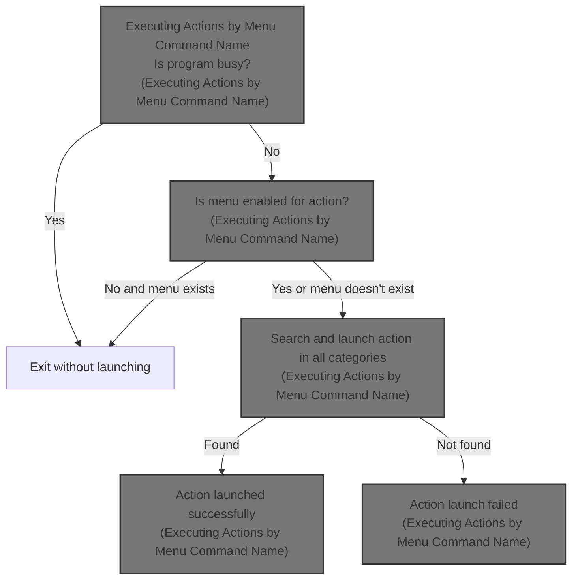

This document explains the flow of executing user actions by their menu command names. The system validates program state and menu availability before searching through a sequence of action categories to find and execute the requested command. It returns whether the action was successfully launched.



# Executing Actions by Menu Command Name

```mermaid
%%{init: {"flowchart": {"defaultRenderer": "elk"}} }%%
flowchart TD
    node1{"Is program busy?"}
    node1 -->|"Yes"| node2["Exit without launching"]
    node1 -->|"No"| node3{"Skip validation?"}
    node3 -->|"No"| node4{"Is menu enabled for action?"}
    node3 -->|"Yes"| node5["Skip menu validation"]
    node4 -->|"No and menu exists"| node2
    node4 -->|"Yes or menu doesn't exist"| node5
    node5 --> node6["Launch non-menu UI tool action"]
    node6 -->|"Found"| node7["Action launched successfully"]
    node6 -->|"Not found"| node8["Launch File menu action"]
    node8 -->|"Found"| node7
    node8 -->|"Not found"| node9["Launch Edit menu action"]
    node9 -->|"Found"| node7
    node9 -->|"Not found"| node10["Launch Image menu action"]
    node10 -->|"Found"| node7
    node10 -->|"Not found"| node11["Launch Layer menu action"]
    node11 -->|"Found"| node7
    node11 -->|"Not found"| node12["Launch Adjustments menu action"]
    node12 -->|"Found"| node7
    node12 -->|"Not found"| node13["Launch Effects menu action"]
    node13 -->|"Found"| node7
    node13 -->|"Not found"| node14["Launch Tools menu action"]
    node14 -->|"Found"| node7
    node14 -->|"Not found"| node15["Launch View menu action"]
    node15 -->|"Found"| node7
    node15 -->|"Not found"| node16["Launch Window menu action"]
    node16 -->|"Found"| node7
    node16 -->|"Not found"| node17["Launch Help menu action"]
    node17 -->|"Found"| node7
    node17 -->|"Not found"| node18["Launch Misc actions"]
    node18 -->|"Found"| node7
    node18 -->|"Not found"| node19["Action launch failed"]

    click node1 openCode "Modules/Actions.bas:109:110"
    click node4 openCode "Modules/Actions.bas:118:132"
    click node6 openCode "Modules/Actions.bas:138:139"
    click node8 openCode "Modules/Actions.bas:140:143"
    click node9 openCode "Modules/Actions.bas:144:145"
    click node10 openCode "Modules/Actions.bas:146:147"
    click node11 openCode "Modules/Actions.bas:501:690"
    click node12 openCode "Modules/Actions.bas:759:911"
    click node13 openCode "Modules/Actions.bas:913:1210"
    click node14 openCode "Modules/Actions.bas:147:148"
    click node15 openCode "Modules/Actions.bas:148:149"
    click node16 openCode "Modules/Actions.bas:149:150"
    click node17 openCode "Modules/Actions.bas:150:151"
    click node18 openCode "Modules/Actions.bas:151:152"
    click node19 openCode "Modules/Actions.bas:153:154"
classDef HeadingStyle fill:#777777,stroke:#333,stroke-width:2px;

%% Swimm:
%% %%{init: {"flowchart": {"defaultRenderer": "elk"}} }%%
%% flowchart TD
%%     node1{"Is program busy?"}
%%     node1 -->|"Yes"| node2["Exit without launching"]
%%     node1 -->|"No"| node3{"Skip validation?"}
%%     node3 -->|"No"| node4{"Is menu enabled for action?"}
%%     node3 -->|"Yes"| node5["Skip menu validation"]
%%     node4 -->|"No and menu exists"| node2
%%     node4 -->|"Yes or menu doesn't exist"| node5
%%     node5 --> node6["Launch non-menu UI tool action"]
%%     node6 -->|"Found"| node7["Action launched successfully"]
%%     node6 -->|"Not found"| node8["Launch File menu action"]
%%     node8 -->|"Found"| node7
%%     node8 -->|"Not found"| node9["Launch Edit menu action"]
%%     node9 -->|"Found"| node7
%%     node9 -->|"Not found"| node10["Launch Image menu action"]
%%     node10 -->|"Found"| node7
%%     node10 -->|"Not found"| node11["Launch Layer menu action"]
%%     node11 -->|"Found"| node7
%%     node11 -->|"Not found"| node12["Launch Adjustments menu action"]
%%     node12 -->|"Found"| node7
%%     node12 -->|"Not found"| node13["Launch Effects menu action"]
%%     node13 -->|"Found"| node7
%%     node13 -->|"Not found"| node14["Launch Tools menu action"]
%%     node14 -->|"Found"| node7
%%     node14 -->|"Not found"| node15["Launch View menu action"]
%%     node15 -->|"Found"| node7
%%     node15 -->|"Not found"| node16["Launch Window menu action"]
%%     node16 -->|"Found"| node7
%%     node16 -->|"Not found"| node17["Launch Help menu action"]
%%     node17 -->|"Found"| node7
%%     node17 -->|"Not found"| node18["Launch Misc actions"]
%%     node18 -->|"Found"| node7
%%     node18 -->|"Not found"| node19["Action launch failed"]
%% 
%%     click node1 openCode "<SwmPath>[Modules/Actions.bas](Modules/Actions.bas)</SwmPath>:109:110"
%%     click node4 openCode "<SwmPath>[Modules/Actions.bas](Modules/Actions.bas)</SwmPath>:118:132"
%%     click node6 openCode "<SwmPath>[Modules/Actions.bas](Modules/Actions.bas)</SwmPath>:138:139"
%%     click node8 openCode "<SwmPath>[Modules/Actions.bas](Modules/Actions.bas)</SwmPath>:140:143"
%%     click node9 openCode "<SwmPath>[Modules/Actions.bas](Modules/Actions.bas)</SwmPath>:144:145"
%%     click node10 openCode "<SwmPath>[Modules/Actions.bas](Modules/Actions.bas)</SwmPath>:146:147"
%%     click node11 openCode "<SwmPath>[Modules/Actions.bas](Modules/Actions.bas)</SwmPath>:501:690"
%%     click node12 openCode "<SwmPath>[Modules/Actions.bas](Modules/Actions.bas)</SwmPath>:759:911"
%%     click node13 openCode "<SwmPath>[Modules/Actions.bas](Modules/Actions.bas)</SwmPath>:913:1210"
%%     click node14 openCode "<SwmPath>[Modules/Actions.bas](Modules/Actions.bas)</SwmPath>:147:148"
%%     click node15 openCode "<SwmPath>[Modules/Actions.bas](Modules/Actions.bas)</SwmPath>:148:149"
%%     click node16 openCode "<SwmPath>[Modules/Actions.bas](Modules/Actions.bas)</SwmPath>:149:150"
%%     click node17 openCode "<SwmPath>[Modules/Actions.bas](Modules/Actions.bas)</SwmPath>:150:151"
%%     click node18 openCode "<SwmPath>[Modules/Actions.bas](Modules/Actions.bas)</SwmPath>:151:152"
%%     click node19 openCode "<SwmPath>[Modules/Actions.bas](Modules/Actions.bas)</SwmPath>:153:154"
%% classDef HeadingStyle fill:#777777,stroke:#333,stroke-width:2px;
```



<SwmSnippet path="/Modules/Actions.bas" line="104">

---

In <SwmToken path="Modules/Actions.bas" pos="104:4:4" line-data="Public Function LaunchAction_ByName(ByRef srcMenuName As String, Optional ByVal actionSource As PD_ActionSource = pdas_Menu, Optional ByVal skipValidation As Boolean = False, Optional ByVal targetLayerIndex As Long = -1) As Boolean">`LaunchAction_ByName`</SwmToken>, the function first checks if the program is busy or if the menu item is enabled. If the menu item is disabled (except for some exceptions), it stops. Then it tries to launch file-related actions by calling <SwmToken path="Modules/Actions.bas" pos="141:15:15" line-data="    If (Not cmdFound) Then cmdFound = Launch_ByName_MenuFile(srcMenuName, actionSource)">`Launch_ByName_MenuFile`</SwmToken>, which is the first step in a sequence that searches through menu categories to find and execute the requested action.

```visual basic
Public Function LaunchAction_ByName(ByRef srcMenuName As String, Optional ByVal actionSource As PD_ActionSource = pdas_Menu, Optional ByVal skipValidation As Boolean = False, Optional ByVal targetLayerIndex As Long = -1) As Boolean
    
    LaunchAction_ByName = False
    
    'Failsafe check for other actions already processing in the background
    If Processor.IsProgramBusy() Then Exit Function
    
    'Failsafe check to see if the menu associated with an action is enabled; if it isn't, that's an
    ' excellent surrogate for "do not allow this operation to proceed".  (Note that this is only
    ' useful for actions with a menu surrogate.  If an action doesn't have a menu surrogate, we ignore
    ' the return from this function.)
    Dim mnuDoesntExist As Boolean
    
    'The user *can* choose to skip validation (see comments at the top of this function).
    If (Not skipValidation) Then
        If (Not Menus.IsMenuEnabled(srcMenuName, mnuDoesntExist)) Then
            If (Not mnuDoesntExist) Then
                
                'Check for some known exceptions to this rule.  These are primarily convenience functions,
                ' which automatically remap to a similar task when the requested one isn't available.
                ' (For example, Ctrl+V is "Paste as new layer", but if no image is open, we silently remap
                ' to "Paste as new image".)
                If (Not Strings.StringsEqualAny(srcMenuName, True, "edit_pasteaslayer")) Then
                    Exit Function
                End If
                
            End If
        End If
    End If
    
    'Helper functions exist for each main menu.  Once a command is located, we can stop searching.
    Dim cmdFound As Boolean: cmdFound = False
    
    'Before searching menu items, perform a "quick" search for UI-specific tool actions
    If (Not cmdFound) Then cmdFound = Launch_ByName_NonMenu(srcMenuName, actionSource)
    
    'Search each menu group in turn
    If (Not cmdFound) Then cmdFound = Launch_ByName_MenuFile(srcMenuName, actionSource)
    If (Not cmdFound) Then cmdFound = Launch_ByName_MenuEdit(srcMenuName, actionSource)
    If (Not cmdFound) Then cmdFound = Launch_ByName_MenuImage(srcMenuName, actionSource)
```

---

</SwmSnippet>

<SwmSnippet path="/Modules/Actions.bas" line="169">

---

<SwmToken path="Modules/Actions.bas" pos="169:4:4" line-data="Private Function Launch_ByName_MenuFile(ByRef srcMenuName As String, Optional ByVal actionSource As PD_ActionSource = pdas_Menu) As Boolean">`Launch_ByName_MenuFile`</SwmToken> matches the command string against file-related actions using a Select Case. It calls Process or other functions to execute commands, checking if an image is active when needed. It also handles recent file commands by extracting the index and loading the file.

```visual basic
Private Function Launch_ByName_MenuFile(ByRef srcMenuName As String, Optional ByVal actionSource As PD_ActionSource = pdas_Menu) As Boolean

    Dim cmdFound As Boolean: cmdFound = True
    
    Select Case srcMenuName
    
        Case "file_new"
            Process "New image", True
            
        Case "file_open"
            Process "Open", True
            
        Case "file_openrecent"
            'Top-level menu only; see the end of this function for handling actual recent file actions.
            ' (Note that the search bar does present this term, and if clicked, we will simply load the
            ' *top* item in the Recent Files list.)
            If (actionSource = pdas_Search) Or (actionSource = pdas_Hotkey) Then
                If (LenB(g_RecentFiles.GetFullPath(0)) <> 0) Then Loading.LoadFileAsNewImage g_RecentFiles.GetFullPath(0)
            End If
            
            Case "file_open_allrecent"
                Loading.LoadAllRecentFiles
            
            Case "file_open_clearrecent"
                If (Not g_RecentFiles Is Nothing) Then g_RecentFiles.ClearList
            
        Case "file_import"
            Case "file_import_paste"
                Process "Paste to new image", False, , UNDO_Nothing, , False
                
            Case "file_import_scanner"
                Process "Scan image", True
                
            Case "file_import_selectscanner"
                Process "Select scanner or camera", True
                
            Case "file_import_web"
                Process "Internet import", True
                
            Case "file_import_screenshot"
                Process "Screen capture", True
                
        Case "file_close"
            If (Not PDImages.IsImageActive()) Then Exit Function
            Process "Close", True
            
        Case "file_closeall"
            If (Not PDImages.IsImageActive()) Then Exit Function
            Process "Close all", True
            
        Case "file_save"
            If (Not PDImages.IsImageActive()) Then Exit Function
            Process "Save", True
            
        Case "file_savecopy"
            If (Not PDImages.IsImageActive()) Then Exit Function
            Process "Save copy", True
            
        Case "file_saveas"
            If (Not PDImages.IsImageActive()) Then Exit Function
            Process "Save as", True
            
        Case "file_revert"
            If (Not PDImages.IsImageActive()) Then Exit Function
            Process "Revert", False, , UNDO_Everything
            
        Case "file_export"
            Case "file_export_image"
                If (Not PDImages.IsImageActive()) Then Exit Function
                Process "Export image", True
            
            Case "file_export_layers"
                If (Not PDImages.IsImageActive()) Then Exit Function
                Process "Export layers", True
                
            Case "file_export_animation"
                If (Not PDImages.IsImageActive()) Then Exit Function
                Process "Export animation", True
                
            Case "file_export_colorlookup"
                If (Not PDImages.IsImageActive()) Then Exit Function
                Process "Export color lookup", True
                
            Case "file_export_colorprofile"
                If (Not PDImages.IsImageActive()) Then Exit Function
                Process "Export color profile", True
                
            Case "file_export_palette"
                If (Not PDImages.IsImageActive()) Then Exit Function
                Process "Export palette", True
                
        Case "file_batch"
            Case "file_batch_process"
                Process "Batch wizard", True
                
            Case "file_batch_repair"
                ShowPDDialog vbModal, FormBatchRepair
                
        Case "file_print"
            If (Not PDImages.IsImageActive()) Then Exit Function
            Process "Print", True
            
        Case "file_quit"
            Process "Exit program", True
            
        Case Else
            cmdFound = False
        
    End Select
    
    'If we haven't found a match, look for commands related to the Recent Files menu;
    ' these are preceded by the unique "file_open_recent_[n]" command, where [n] is the index of
    ' the recent file to open (0-based).
    If (Not cmdFound) Then
    
        cmdFound = Strings.StringsEqualLeft(srcMenuName, COMMAND_FILE_OPEN_RECENT, True)
        If cmdFound Then
        
            '(Attempt to) load the target file
            Dim targetIndex As Long
            targetIndex = Val(Right$(srcMenuName, Len(srcMenuName) - Len(COMMAND_FILE_OPEN_RECENT)))
            If (LenB(g_RecentFiles.GetFullPath(targetIndex)) <> 0) Then Loading.LoadFileAsNewImage g_RecentFiles.GetFullPath(targetIndex)
            
        End If
        
    End If
    
    Launch_ByName_MenuFile = cmdFound
    
End Function
```

---

</SwmSnippet>

<SwmSnippet path="/Modules/Actions.bas" line="144">

---

After returning from <SwmToken path="Modules/Actions.bas" pos="141:15:15" line-data="    If (Not cmdFound) Then cmdFound = Launch_ByName_MenuFile(srcMenuName, actionSource)">`Launch_ByName_MenuFile`</SwmToken>, <SwmToken path="Modules/Actions.bas" pos="104:4:4" line-data="Public Function LaunchAction_ByName(ByRef srcMenuName As String, Optional ByVal actionSource As PD_ActionSource = pdas_Menu, Optional ByVal skipValidation As Boolean = False, Optional ByVal targetLayerIndex As Long = -1) As Boolean">`LaunchAction_ByName`</SwmToken> checks if the command was found. If not, it calls <SwmToken path="Modules/Actions.bas" pos="144:15:15" line-data="    If (Not cmdFound) Then cmdFound = Launch_ByName_MenuLayer(srcMenuName, actionSource, targetLayerIndex)">`Launch_ByName_MenuLayer`</SwmToken> to try layer-related actions next, using the target layer index if provided, continuing the search sequence.

```visual basic
    If (Not cmdFound) Then cmdFound = Launch_ByName_MenuLayer(srcMenuName, actionSource, targetLayerIndex)
    If (Not cmdFound) Then cmdFound = Launch_ByName_MenuSelect(srcMenuName, actionSource)
```

---

</SwmSnippet>

<SwmSnippet path="/Modules/Actions.bas" line="501">

---

<SwmToken path="Modules/Actions.bas" pos="501:4:4" line-data="Private Function Launch_ByName_MenuLayer(ByRef srcMenuName As String, Optional ByVal actionSource As PD_ActionSource = pdas_Menu, Optional ByVal targetLayerIndex As Long = -1) As Boolean">`Launch_ByName_MenuLayer`</SwmToken> runs layer-related commands by matching the command string and calling Process with the target layer index, defaulting to the active layer if the index is invalid. It covers adding, deleting, merging, ordering, visibility, cropping, orientation, resizing, transparency, rasterizing, and splitting layers.

```visual basic
Private Function Launch_ByName_MenuLayer(ByRef srcMenuName As String, Optional ByVal actionSource As PD_ActionSource = pdas_Menu, Optional ByVal targetLayerIndex As Long = -1) As Boolean

    'All actions in this category require an open image.  If no images are open, do not apply the requested action.
    If (Not PDImages.IsImageActive()) Then Exit Function
    
    If (targetLayerIndex < 0) Then
        targetLayerIndex = PDImages.GetActiveImage.GetActiveLayerIndex
    ElseIf (targetLayerIndex >= PDImages.GetActiveImage.GetNumOfLayers) Then
        targetLayerIndex = PDImages.GetActiveImage.GetActiveLayerIndex
    End If
    
    Dim cmdFound As Boolean: cmdFound = True
    
    Select Case srcMenuName
    
        Case "layer_add"
            Case "layer_addbasic"
                Process "Add new layer", True
                
            Case "layer_addblank"
                Process "Add blank layer", False, BuildParamList("targetlayer", targetLayerIndex), UNDO_Image_VectorSafe
                
            Case "layer_duplicate"
                Process "Duplicate Layer", False, BuildParamList("targetlayer", targetLayerIndex), UNDO_Image_VectorSafe
                
            Case "layer_addfromclipboard"
                Process "Paste", False, , UNDO_Image_VectorSafe
                
            Case "layer_addfromfile"
                Process "New layer from file", True
                
            Case "layer_addfromvisiblelayers"
                Process "New layer from visible layers", False, , UNDO_Image_VectorSafe
                
            Case "layer_addviacopy"
                Process "Layer via copy", False, BuildParamList("targetlayer", targetLayerIndex), UNDO_Image_VectorSafe
                
            Case "layer_addviacut"
                Process "Layer via cut", False, BuildParamList("targetlayer", targetLayerIndex), UNDO_Image
                
        Case "layer_delete"
            Case "layer_deletecurrent"
                Process "Delete layer", False, BuildParamList("layerindex", targetLayerIndex), UNDO_Image_VectorSafe
                
            Case "layer_deletehidden"
                Process "Delete hidden layers", False, , UNDO_Image_VectorSafe
        
        Case "layer_replace"
            Case "layer_replacefromclipboard"
                Process "Replace layer from clipboard", False, createUndo:=UNDO_Layer
                
            Case "layer_replacefromfile"
                Process "Replace layer from file", True
                
            Case "layer_replacefromvisiblelayers"
                Process "Replace layer from visible layers", False, createUndo:=UNDO_Layer
                
        Case "layer_mergeup"
            Process "Merge layer up", False, BuildParamList("layerindex", targetLayerIndex), UNDO_Image
            
        Case "layer_mergedown"
            Process "Merge layer down", False, BuildParamList("layerindex", targetLayerIndex), UNDO_Image
            
        Case "layer_order"
            Case "layer_gotop"
                Process "Go to top layer", False, vbNullString, UNDO_Nothing
                
            Case "layer_goup"
                Process "Go to layer above", False, vbNullString, UNDO_Nothing
                
            Case "layer_godown"
                Process "Go to layer below", False, vbNullString, UNDO_Nothing
                
            Case "layer_gobottom"
                Process "Go to bottom layer", False, vbNullString, UNDO_Nothing
            
            Case "layer_movetop"
                Process "Raise layer to top", False, BuildParamList("layerindex", targetLayerIndex), UNDO_ImageHeader
                
            Case "layer_moveup"
                Process "Raise layer", False, BuildParamList("layerindex", targetLayerIndex), UNDO_ImageHeader
                
            Case "layer_movedown"
                Process "Lower layer", False, BuildParamList("layerindex", targetLayerIndex), UNDO_ImageHeader
                
            Case "layer_movebottom"
                Process "Lower layer to bottom", False, BuildParamList("layerindex", targetLayerIndex), UNDO_ImageHeader
            
            Case "layer_reverse"
                Process "Reverse layer order", False, vbNullString, UNDO_Image
        
        Case "layer_visibility"
            Case "layer_show"
                Process "Toggle layer visibility", False, BuildParamList("layerindex", targetLayerIndex), UNDO_LayerHeader
                
            Case "layer_showonly"
                Process "Show only this layer", False, BuildParamList("layerindex", targetLayerIndex), UNDO_ImageHeader
                
            Case "layer_hideonly"
                Process "Hide only this layer", False, BuildParamList("layerindex", targetLayerIndex), UNDO_ImageHeader
                
            Case "layer_showall"
                Process "Show all layers", False, vbNullString, UNDO_ImageHeader
                
            Case "layer_hideall"
                Process "Hide all layers", False, vbNullString, UNDO_ImageHeader
        
        Case "layer_crop"
            Case "layer_cropselection"
                Process "Crop layer to selection", , , UNDO_Layer
            
            Case "layer_pad"
                Process "Pad layer to image size", , , UNDO_Layer
                
            Case "layer_trim"
                Process "Trim empty layer borders", , , UNDO_Layer
            
        Case "layer_orientation"
            Case "layer_straighten"
                Process "Straighten layer", True
                
            Case "layer_rotate90"
                Process "Rotate layer 90 clockwise", , , UNDO_Layer
                
            Case "layer_rotate270"
                Process "Rotate layer 90 counter-clockwise", , , UNDO_Layer
                
            Case "layer_rotate180"
                Process "Rotate layer 180", , , UNDO_Layer
                
            Case "layer_rotatearbitrary"
                Process "Arbitrary layer rotation", True
                
            Case "layer_fliphorizontal"
                Process "Flip layer horizontally", , , UNDO_Layer
                
            Case "layer_flipvertical"
                Process "Flip layer vertically", , , UNDO_Layer
                
        Case "layer_size"
            Case "layer_resetsize"
                Process "Reset layer size", False, BuildParamList("layerindex", targetLayerIndex), UNDO_LayerHeader
                
            Case "layer_resize"
                Process "Resize layer", True
                
            Case "layer_contentawareresize"
                Process "Content-aware layer resize", True
                
            Case "layer_fittoimage"
                Process "Fit layer to image", False, BuildParamList("layerindex", targetLayerIndex), UNDO_LayerHeader
                
        Case "layer_transparency"
            Case "layer_colortoalpha"
                Process "Color to alpha", True
                
            Case "layer_luminancetoalpha"
                Process "Luminance to alpha", True
                
            Case "layer_removealpha"
                Process "Remove alpha channel", True
            
            Case "layer_thresholdalpha"
                Process "Threshold alpha", True
        
        Case "layer_rasterize"
            Case "layer_rasterizecurrent"
                Process "Rasterize layer", False, BuildParamList("layerindex", targetLayerIndex), UNDO_Layer
                
            Case "layer_rasterizeall"
                Process "Rasterize all layers", , , UNDO_Image
        
        Case "layer_split"
            Case "layer_splitlayertoimage"
                Process "Split layer into image", True
                
            Case "layer_splitalllayerstoimages"
                Process "Split layers into images", True
            
            Case "layer_splitimagestolayers"
                Process "Split images into layers", True
                
        Case Else
            cmdFound = False
            
    End Select
    
    Launch_ByName_MenuLayer = cmdFound
    
End Function
```

---

</SwmSnippet>

<SwmSnippet path="/Modules/Actions.bas" line="146">

---

After returning from <SwmToken path="Modules/Actions.bas" pos="144:15:15" line-data="    If (Not cmdFound) Then cmdFound = Launch_ByName_MenuLayer(srcMenuName, actionSource, targetLayerIndex)">`Launch_ByName_MenuLayer`</SwmToken>, <SwmToken path="Modules/Actions.bas" pos="104:4:4" line-data="Public Function LaunchAction_ByName(ByRef srcMenuName As String, Optional ByVal actionSource As PD_ActionSource = pdas_Menu, Optional ByVal skipValidation As Boolean = False, Optional ByVal targetLayerIndex As Long = -1) As Boolean">`LaunchAction_ByName`</SwmToken> checks if the command was found. If not, it calls <SwmToken path="Modules/Actions.bas" pos="146:15:15" line-data="    If (Not cmdFound) Then cmdFound = Launch_ByName_MenuAdjustments(srcMenuName, actionSource)">`Launch_ByName_MenuAdjustments`</SwmToken> to try adjustment-related actions next, continuing the search sequence.

```visual basic
    If (Not cmdFound) Then cmdFound = Launch_ByName_MenuAdjustments(srcMenuName, actionSource)
```

---

</SwmSnippet>

<SwmSnippet path="/Modules/Actions.bas" line="759">

---

<SwmToken path="Modules/Actions.bas" pos="759:4:4" line-data="Private Function Launch_ByName_MenuAdjustments(ByRef srcMenuName As String, Optional ByVal actionSource As PD_ActionSource = pdas_Menu) As Boolean">`Launch_ByName_MenuAdjustments`</SwmToken> handles image adjustment commands by matching the command string and calling Process or showing dialogs. It requires an active image and returns whether the command was found.

```visual basic
Private Function Launch_ByName_MenuAdjustments(ByRef srcMenuName As String, Optional ByVal actionSource As PD_ActionSource = pdas_Menu) As Boolean

    'All actions in this category require an open image.  If no images are open, do not apply the requested action.
    If (Not PDImages.IsImageActive()) Then Exit Function
    
    Dim cmdFound As Boolean: cmdFound = True
    
    Select Case srcMenuName
    
        Case "adj_autocorrect"
            Process "Auto correct", False, , UNDO_Layer
            
        Case "adj_autoenhance"
            Process "Auto enhance", False, , UNDO_Layer
            
        Case "adj_blackandwhite"
            Process "Black and white", True
            
        Case "adj_bandc"
            Process "Brightness and contrast", True
            
        Case "adj_colorbalance"
            Process "Color balance", True
            
        Case "adj_curves"
            Process "Curves", True
            
        Case "adj_levels"
            Process "Levels", True
            
        Case "adj_sandh"
            Process "Shadows and highlights", True
            
        Case "adj_vibrance"
            Process "Vibrance", True
            
        Case "adj_whitebalance"
            Process "White balance", True
            
        Case "adj_channels"
            Case "adj_channelmixer"
                Process "Channel mixer", True
                
            Case "adj_rechannel"
                Process "Rechannel", True
                
            Case "adj_maxchannel"
                Process "Maximum channel", , , UNDO_Layer
                
            Case "adj_minchannel"
                Process "Minimum channel", , , UNDO_Layer
                
            Case "adj_shiftchannelsleft"
                Process "Shift colors (left)", , , UNDO_Layer
                
            Case "adj_shiftchannelsright"
                Process "Shift colors (right)", , , UNDO_Layer
                
        Case "adj_color"
            'Case "adj_colorbalance"    'Covered by parent menu
            'Case "adj_whitebalance"    'Covered by parent menu
            
            Case "adj_hsl"
                Process "Hue and saturation", True
                
            Case "adj_temperature"
                Process "Temperature", True
                
            Case "adj_tint"
                Process "Tint", True
                
            'Case "adj_vibrance"        'Covered by parent menu
            'Case "adj_blackandwhite"   'Covered by parent menu
            
            Case "adj_colorlookup"
                Process "Color lookup", True
                
            Case "adj_colorize"
                Process "Colorize", True
                
            Case "adj_photofilters"
                Process "Photo filter", True
                
            Case "adj_replacecolor"
                Process "Replace color", True
                
            Case "adj_sepia"
                Process "Sepia", True
                
            Case "adj_splittone"
                Process "Split toning", True
                
        Case "adj_histogram"
            Case "adj_histogramdisplay"
                ShowPDDialog vbModal, FormHistogram
                
            Case "adj_histogramequalize"
                Process "Equalize", True
                
            Case "adj_histogramstretch"
                Process "Stretch histogram", , , UNDO_Layer
                
        Case "adj_invert"
            Case "adj_invertcmyk"
                Process "Film negative", , , UNDO_Layer
                
            Case "adj_inverthue"
                Process "Invert hue", , , UNDO_Layer
                
            Case "adj_invertrgb"
                Process "Invert RGB", , , UNDO_Layer
                
        Case "adj_lighting"
            'Case "adj_bandc"   'Covered by parent menu
            'Case "adj_curves"  'Covered by parent menu
            
            Case "adj_dehaze"
                Process "Dehaze", True
            
            Case "adj_exposure"
                Process "Exposure", True
            
            Case "adj_gamma"
                Process "Gamma", True
                
            Case "adj_hdr"
                Process "HDR", True
                
            'Case "adj_levels"  'Covered by parent menu
            'Case "adj_sandh"   'Covered by parent menu
            
        Case "adj_map"
            Case "adj_gradientmap"
                Process "Gradient map", True
                
            Case "adj_palettemap"
                Process "Palette map", True
            
        Case "adj_monochrome"
            Case "adj_colortomonochrome"
                Process "Color to monochrome", True
                
            Case "adj_monochrometogray"
                Process "Monochrome to gray", True
            
        Case Else
            cmdFound = False
                
    End Select
    
    Launch_ByName_MenuAdjustments = cmdFound
    
End Function
```

---

</SwmSnippet>

<SwmSnippet path="/Modules/Actions.bas" line="147">

---

After returning from <SwmToken path="Modules/Actions.bas" pos="146:15:15" line-data="    If (Not cmdFound) Then cmdFound = Launch_ByName_MenuAdjustments(srcMenuName, actionSource)">`Launch_ByName_MenuAdjustments`</SwmToken>, <SwmToken path="Modules/Actions.bas" pos="154:1:1" line-data="    LaunchAction_ByName = cmdFound">`LaunchAction_ByName`</SwmToken> continues searching by calling <SwmToken path="Modules/Actions.bas" pos="147:15:15" line-data="    If (Not cmdFound) Then cmdFound = Launch_ByName_MenuEffects(srcMenuName, actionSource)">`Launch_ByName_MenuEffects`</SwmToken> next, following the predefined menu search order.

```visual basic
    If (Not cmdFound) Then cmdFound = Launch_ByName_MenuEffects(srcMenuName, actionSource)
    If (Not cmdFound) Then cmdFound = Launch_ByName_MenuTools(srcMenuName, actionSource)
    If (Not cmdFound) Then cmdFound = Launch_ByName_MenuView(srcMenuName, actionSource)
    If (Not cmdFound) Then cmdFound = Launch_ByName_MenuWindow(srcMenuName, actionSource)
    If (Not cmdFound) Then cmdFound = Launch_ByName_MenuHelp(srcMenuName, actionSource)
    If (Not cmdFound) Then cmdFound = Launch_ByName_Misc(srcMenuName, actionSource)
    
    LaunchAction_ByName = cmdFound
    
```

---

</SwmSnippet>

<SwmSnippet path="/Modules/Actions.bas" line="913">

---

<SwmToken path="Modules/Actions.bas" pos="913:4:4" line-data="Private Function Launch_ByName_MenuEffects(ByRef srcMenuName As String, Optional ByVal actionSource As PD_ActionSource = pdas_Menu) As Boolean">`Launch_ByName_MenuEffects`</SwmToken> maps effect commands to processing calls, only if an image is open.

```visual basic
Private Function Launch_ByName_MenuEffects(ByRef srcMenuName As String, Optional ByVal actionSource As PD_ActionSource = pdas_Menu) As Boolean

    'All actions in this category require an open image.  If no images are open, do not apply the requested action.
    If (Not PDImages.IsImageActive()) Then Exit Function
    
    Dim cmdFound As Boolean: cmdFound = True
    
    Select Case srcMenuName
    
        Case "effects_artistic"
            Case "effects_colorpencil"
                Process "Colored pencil", True
                
            Case "effects_comicbook"
                Process "Comic book", True
                
            Case "effects_figuredglass"
                Process "Figured glass", True
                
            Case "effects_filmnoir"
                Process "Film noir", True
                
            Case "effects_glasstiles"
                Process "Glass tiles", True
                
            Case "effects_kaleidoscope"
                Process "Kaleidoscope", True
                
            Case "effects_modernart"
                Process "Modern art", True
                
            Case "effects_oilpainting"
                Process "Oil painting", True
                
            Case "effects_plasticwrap"
                Process "Plastic wrap", True
                
            Case "effects_posterize"
                Process "Posterize", True
                
            Case "effects_relief"
                Process "Relief", True
                
            Case "effects_stainedglass"
                Process "Stained glass", True
                
        Case "effects_blur"
            Case "effects_boxblur"
                Process "Box blur", True
                
            Case "effects_gaussianblur"
                Process "Gaussian blur", True
                
            Case "effects_surfaceblur"
                Process "Surface blur", True
                
            Case "effects_motionblur"
                Process "Motion blur", True
                
            Case "effects_radialblur"
                Process "Radial blur", True
                
            Case "effects_zoomblur"
                Process "Zoom blur", True
                
        Case "effects_distort"
            Case "effects_fixlensdistort"
                Process "Correct lens distortion", True
                
            Case "effects_donut"
                Process "Donut", True
            
            Case "effects_droste"
                Process "Droste", True
                
            Case "effects_lens"
                Process "Apply lens distortion", True
                
            Case "effects_pinchandwhirl"
                Process "Pinch and whirl", True
                
            Case "effects_poke"
                Process "Poke", True
                
            Case "effects_ripple"
                Process "Ripple", True
                
            Case "effects_squish"
                Process "Squish", True
                
            Case "effects_swirl"
                Process "Swirl", True
                
            Case "effects_waves"
                Process "Waves", True
                
            Case "effects_miscdistort"
                Process "Miscellaneous distort", True
                
        Case "effects_edges"
            Case "effects_emboss"
                Process "Emboss", True
                
            Case "effects_enhanceedges"
                Process "Enhance edges", True
                
            Case "effects_findedges"
                Process "Find edges", True
                
            Case "effects_gradientflow"
                Process "Gradient flow", True
                
            Case "effects_rangefilter"
                Process "Range filter", True
                
            Case "effects_tracecontour"
                Process "Trace contour", True
                
        Case "effects_lightandshadow"
            Case "effects_blacklight"
                Process "Black light", True
                
            Case "effects_bumpmap"
                Process "Bump map", True
                
            Case "effects_crossscreen"
                Process "Cross-screen", True
            
            Case "effects_rainbow"
                Process "Rainbow", True
                
            Case "effects_sunshine"
                Process "Sunshine", True
                
            Case "effects_dilate"
                Process "Dilate (maximum rank)", True
                
            Case "effects_erode"
                Process "Erode (minimum rank)", True
                
        Case "effects_natural"
            Case "effects_atmosphere"
                Process "Atmosphere", True
                
            Case "effects_fog"
                Process "Fog", True
                
            Case "effects_ignite"
                Process "Ignite", True
                
            Case "effects_lava"
                Process "Lava", True
                
            Case "effects_metal"
                Process "Metal", True
                
            Case "effects_snow"
                Process "Snow", True
                
            Case "effects_underwater"
                Process "Water", True
                
        Case "effects_noise"
            Case "effects_filmgrain"
                Process "Add film grain", True
                
            Case "effects_rgbnoise"
                Process "Add RGB noise", True
                
            Case "effects_anisotropic"
                Process "Anisotropic diffusion", True
            
            'For legacy macros, only; bilateral has been replaced by Blur > Surface Blur
            Case "effects_bilateral"
                Process "Surface blur", True
                
            Case "effects_dustandscratches"
                Process "Dust and scratches", True
                
            Case "effects_harmonicmean"
                Process "Harmonic mean", True
                
            Case "effects_meanshift"
                Process "Mean shift", True
                
            Case "effects_median"
                Process "Median", True
            
            Case "effects_snn"
                Process "Symmetric nearest-neighbor", True
                
        Case "effects_pixelate"
            Case "effects_colorhalftone"
                Process "Color halftone", True
                
            Case "effects_crystallize"
                Process "Crystallize", True
                
            Case "effects_fragment"
                Process "Fragment", True
                
            Case "effects_mezzotint"
                Process "Mezzotint", True
                
            Case "effects_mosaic"
                Process "Mosaic", True
                
            Case "effects_pointillize"
                Process "Pointillize", True
        
        Case "effects_render"
            Case "effects_clouds"
                Process "Clouds", True
                
            Case "effects_fibers"
                Process "Fibers", True
            
            Case "effects_truchet"
                Process "Truchet", True
            
        Case "effects_sharpentop"
            Case "effects_sharpen"
                Process "Sharpen", True
                
            Case "effects_unsharp"
                Process "Unsharp mask", True
                
        Case "effects_stylize"
            Case "effects_antique"
                Process "Antique", True
                
            Case "effects_diffuse"
                Process "Diffuse", True
            
            Case "effects_kuwahara"
                Process "Kuwahara filter", True
                
            Case "effects_outline"
                Process "Outline", True
                
            Case "effects_palette"
                Process "Palette", True
                
            Case "effects_portraitglow"
                Process "Portrait glow", True
                
            Case "effects_solarize"
                Process "Solarize", True
                
            Case "effects_twins"
                Process "Twins", True
                
            Case "effects_vignetting"
                Process "Vignetting", True
                
        Case "effects_transform"
            Case "effects_panandzoom"
                Process "Offset and zoom", True
                
            Case "effects_perspective"
                Process "Perspective", True
                
            Case "effects_polarconversion"
                Process "Polar conversion", True
                
            Case "effects_rotate"
                Process "Rotate", True
                
            Case "effects_shear"
                Process "Shear", True
                
            Case "effects_spherize"
                Process "Spherize", True
                
        Case "effects_animation"
            Case "effects_animation_background"
                Process "Animation background", True
                
            Case "effects_animation_foreground"
                Process "Animation foreground", True
            
            Case "effects_animation_speed"
                Process "Animation playback speed", True
                
        Case "effects_customfilter"
            Process "Custom filter", True
        
        Case "effects_8bf"
            Process "Photoshop (8bf) plugin", True
        
        Case Else
            cmdFound = False
            
    End Select
    
    Launch_ByName_MenuEffects = cmdFound
    
End Function
```

---

</SwmSnippet>

<SwmSnippet path="/Modules/Actions.bas" line="156">

---

After returning from <SwmToken path="Modules/Actions.bas" pos="147:15:15" line-data="    If (Not cmdFound) Then cmdFound = Launch_ByName_MenuEffects(srcMenuName, actionSource)">`Launch_ByName_MenuEffects`</SwmToken>, <SwmToken path="Modules/Actions.bas" pos="165:22:22" line-data="    &#39;If (Not cmdFound) Then PDDebug.LogAction &quot;WARNING: Actions.LaunchAction_ByName received an unknown request: &quot; &amp; srcMenuName">`LaunchAction_ByName`</SwmToken> finishes by trying other menu groups if needed and returns whether any command was found and launched.

```visual basic
    'Before exiting, report a debug note if we found *no* matches.
    '
    'NOTE 2021: this can be useful when adding a new feature to the program (to make sure all triggers for it
    ' execute correctly), but it is *not* useful in day-to-day usage because the menu searcher may find a command,
    ' but choose not to execute it because certain safety conditions aren't met (e.g. Ctrl+S is pressed, but no
    ' image is open).  Many of these validation checks occur at the top of a group of related commands -
    ' e.g. nothing in the Effects category will trigger without an open image - and some of those validation
    ' checks will prevent menu-matching from even occurring.  This will report a "no match found", but only
    ' because large chunks of the search were short-circuited because a validation condition wasn't met.
    'If (Not cmdFound) Then PDDebug.LogAction "WARNING: Actions.LaunchAction_ByName received an unknown request: " & srcMenuName
    
End Function
```

---

</SwmSnippet>

&nbsp;

*This is an auto-generated document by Swimm 🌊 and has not yet been verified by a human*

<SwmMeta version="3.0.0" repo-id="Z2l0aHViJTNBJTNBVkI2UGhvdG9EZW1vbiUzQSUzQUdvcGluYXRocmVkZHk2Ng==" repo-name="VB6PhotoDemon"><sup>Powered by [Swimm](https://app.swimm.io/)</sup></SwmMeta>
