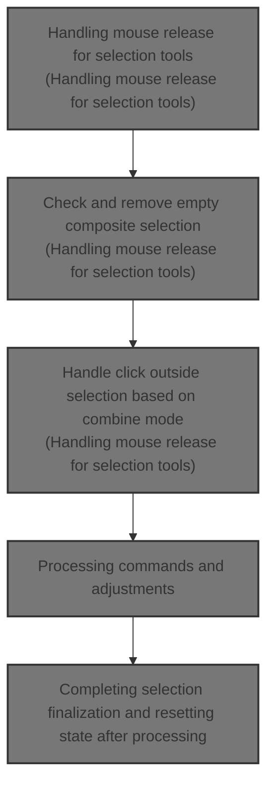
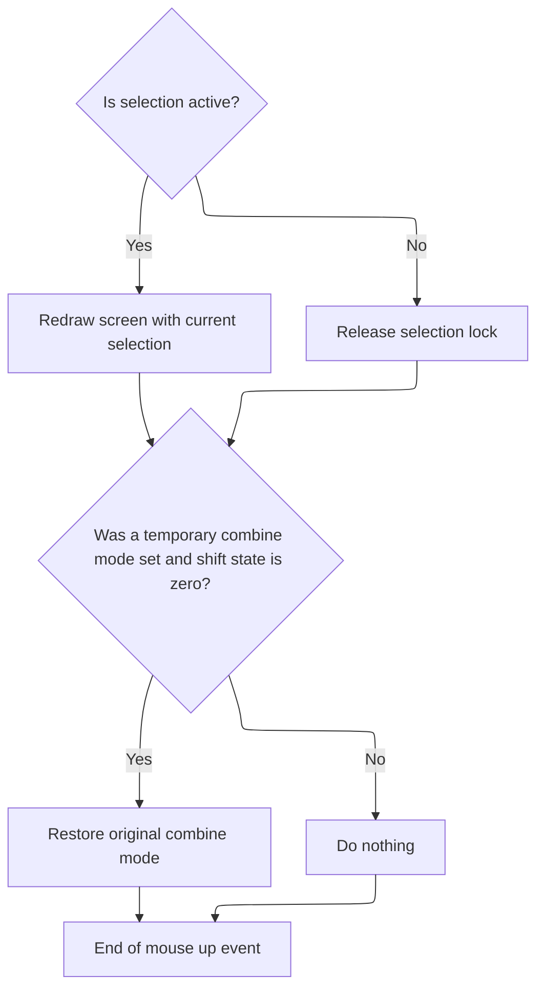

This document describes the process triggered by mouse release events for selection tools, managing selection finalization, erasure, and updates. It ensures invalid or empty selections are removed, composite selections are handled per combine mode, and changes are committed with undo support. The UI is updated to reflect the current selection state.



# Handling mouse release for selection tools

This section handles the mouse release event for various selection tools in the photo editor, managing selection finalization, erasing, and updates to the UI and undo stack.

| Category       | Rule Name                                        | Description                                                                                                                                                                                                                                                                                                                                                                                                                                                                                              |
| -------------- | ------------------------------------------------ | -------------------------------------------------------------------------------------------------------------------------------------------------------------------------------------------------------------------------------------------------------------------------------------------------------------------------------------------------------------------------------------------------------------------------------------------------------------------------------------------------------- |
| Business logic | Remove empty composite selection                 | Composite selections that have no selected pixels (empty) must be automatically removed on mouse release to avoid a no-selection state.                                                                                                                                                                                                                                                                                                                                                                  |
| Business logic | Erase selection on outside click in REPLACE mode | In REPLACE combine mode, a simple click outside the current selection erases the selection on mouse release for rectangle, circle, and lasso tools.                                                                                                                                                                                                                                                                                                                                                      |
| Business logic | Squash composite selections in non-REPLACE modes | In combine modes other than REPLACE, clicking outside the selection does not erase it but instead squashes composite selections into a single selection object.                                                                                                                                                                                                                                                                                                                                          |
| Business logic | Update non-raster selection on mouse up          | For non-raster selection shapes, mouse release updates the selection coordinates and requests a square shape if the shift key is held for constraint.                                                                                                                                                                                                                                                                                                                                                    |
| Business logic | Remove or squash invalid selections              | If all selection coordinates are invalid (<SwmToken path="Modules/SelectionUI.bas" pos="993:4:6" line-data="    &#39; (e.g. Use &quot;subtract&quot; mode to remove the previous selection completely.)">`e.g`</SwmToken>., <SwmToken path="Modules/SelectionUI.bas" pos="1064:26:28" line-data="                    &#39;Check to see if all selection coordinates are invalid (e.g. off-image).">`off-image`</SwmToken>), the selection is removed in REPLACE mode or squashed in other combine modes. |
| Business logic | Commit selection changes with undo               | Selection changes on mouse release are committed with appropriate undo actions depending on whether the selection is created, moved, or resized.                                                                                                                                                                                                                                                                                                                                                         |
| Business logic | Special polygon selection handling               | Polygon selections require special handling on mouse release, including adding points if not closed, locking in changes if closed, and erasing if all points are invalid.                                                                                                                                                                                                                                                                                                                                |
| Business logic | Magic wand selection commit or remove            | Magic wand selections do not support <SwmToken path="Modules/SelectionUI.bas" pos="1220:33:35" line-data="        &#39;Magic wand selections are actually the easiest to handle, as they don&#39;t really support post-creation transforms">`post-creation`</SwmToken> transforms; on mouse release, they are either committed or removed based on coordinate validity.                                                                                                                                  |

<SwmSnippet path="/Modules/SelectionUI.bas" line="970">

---

In <SwmToken path="Modules/SelectionUI.bas" pos="970:4:4" line-data="Public Sub NotifySelectionMouseUp(ByRef srcCanvas As pdCanvas, ByVal Shift As ShiftConstants, ByVal imgX As Single, ByVal imgY As Single, ByVal clickEventAlsoFiring As Boolean, ByVal wasSelectionActiveBeforeMouseEvents As Boolean)">`NotifySelectionMouseUp`</SwmToken>, we start by handling edge cases like <SwmToken path="Modules/SelectionUI.bas" pos="735:26:28" line-data="        &#39; special circumstances (when the user re-clicks the first point or double-clicks).">`double-clicks`</SwmToken> and ignoring input flags. Then we check if the current selection is composite but empty, and if so, we remove it to avoid a no-selection state. Next, for selection tools like rectangle, circle, and lasso, we decide whether to erase the selection on a simple click outside it in REPLACE mode or squash composite selections otherwise. We also finalize selections differently depending on the tool type, updating the UI and redrawing the canvas as needed. Calling <SwmPath>[Modules/Processor.bas](Modules/Processor.bas)</SwmPath>'s Process function helps us commit these selection changes properly, including undo management and UI updates.

```visual basic
Public Sub NotifySelectionMouseUp(ByRef srcCanvas As pdCanvas, ByVal Shift As ShiftConstants, ByVal imgX As Single, ByVal imgY As Single, ByVal clickEventAlsoFiring As Boolean, ByVal wasSelectionActiveBeforeMouseEvents As Boolean)
        
    m_MouseDown = False
    m_HasMouseMoved = False
    
    'If a double-click just occurred, reset the flag and exit - do NOT process this click further
    If m_DblClickOccurred Then
        m_DblClickOccurred = False
        Exit Sub
    End If
    
    'Failsafe for bad mice notifications - if we receive an unexpected trigger while ignoring input,
    ' reset all flags but disallow the interrupted action.
    If m_IgnoreUserInput Then
        m_IgnoreUserInput = False
        Exit Sub
    End If
    
    'Ensure other actions don't trigger while this one is still processing (only affects this class!)
    m_IgnoreUserInput = True
    
    'Composite selections have some interesting possible outcomes vs other selection types.
    ' In particular, there are many ways to produce composite selections with no selected pixels.
    ' (e.g. Use "subtract" mode to remove the previous selection completely.)
    '
    'To prevent this from creating a "nothing selected" state, we auto-detect this state on _MouseUp
    ' and initiate a "Remove Selection" action.
    If PDImages.GetActiveImage.MainSelection.IsCompositeSelection() Then
        
        'Some shapes do not auto-generate a composite mask while drawing (for perf reasons).
        ' Ensure a valid composite mask exists before proceeding.
        With PDImages.GetActiveImage.MainSelection
            If ((.GetSelectionShape = ss_Polygon) And .GetPolygonClosedState) Or (.GetSelectionShape = ss_Lasso) Then
                If (.GetSelectionShape = ss_Lasso) Then PDImages.GetActiveImage.MainSelection.SetLassoClosedState True
                PDImages.GetActiveImage.MainSelection.RequestNewMask
            End If
        End With
        
        'Look for at least one selected pixel.
        If PDImages.GetActiveImage.MainSelection.AreAllCoordinatesInvalid(True) Then
            
            'No pixels are selected. Remove the existing selection, then exit.
            Process "Remove selection", , , IIf(wasSelectionActiveBeforeMouseEvents, UNDO_Selection, UNDO_Nothing), g_CurrentTool
            Viewport.Stage3_CompositeCanvas PDImages.GetActiveImage(), srcCanvas
            GoTo FinishedMouseUp
            
        '/Else do nothing; normal handling, below, covers all other bases!
        End If
    
    End If
    
    'In default REPLACE mode, a single in-place click will erase the current selection.
    ' (In other combine modes, this behavior must be ignored or overridden.)
    Dim eraseThisSelection As Boolean: eraseThisSelection = False
    
    Select Case g_CurrentTool
    
        'Most selection tools finalize the current selection on a _MouseUp event
        Case SELECT_RECT, SELECT_CIRC, SELECT_LASSO
        
            'If a selection was being drawn, lock it into place
            If PDImages.GetActiveImage.IsSelectionActive Then
                
                'Check to see if this mouse location is the same as the initial mouse press. If it is, and that particular
                ' point falls outside the selection, clear the selection from the image.
                Dim selBounds As RectF
                selBounds = PDImages.GetActiveImage.MainSelection.GetCornersLockedRect
                
                'We only enable selection erasing on a click in REPLACE mode.  Other combine modes
                ' (add, subtract, etc) do not erase on a click.
                eraseThisSelection = (clickEventAlsoFiring And (IsCoordSelectionPOI(imgX, imgY, PDImages.GetActiveImage()) = poi_Undefined))
                If (Not eraseThisSelection) Then eraseThisSelection = ((selBounds.Width <= 0) And (selBounds.Height <= 0))
                
                If eraseThisSelection Then
                    
                    'In "replace" mode, just remove the active selection (if any)
                    If (toolpanel_Selections.btsCombine.ListIndex = pdsm_Replace) Then
                        Process "Remove selection", , , IIf(wasSelectionActiveBeforeMouseEvents, UNDO_Selection, UNDO_Nothing), g_CurrentTool
                    
                    'In other modes, squash any active selections together into a single selection object.
                    Else
                        PDImages.GetActiveImage.MainSelection.SquashCompositeToRaster
                    End If
                    
                'The mouse is being released after a significant move event, or on a point of interest to the current selection.
                Else
                
                    'If the selection is not raster-type, pass these final mouse coordinates to it
                    If (PDImages.GetActiveImage.MainSelection.GetSelectionShape <> ss_Raster) Then
                        PDImages.GetActiveImage.MainSelection.RequestSquare m_ShiftForConstrain
                        PDImages.GetActiveImage.MainSelection.SetAdditionalCoordinates imgX, imgY
                        SyncTextToCurrentSelection PDImages.GetActiveImageID()
                    End If
                
                    'Check to see if all selection coordinates are invalid (e.g. off-image).
                    ' If they are, forget about this selection.
                    If PDImages.GetActiveImage.MainSelection.AreAllCoordinatesInvalid Then
                        If (PDImages.GetActiveImage.MainSelection.GetSelectionCombineMode() <> pdsm_Replace) Then
                            PDImages.GetActiveImage.MainSelection.SquashCompositeToRaster
                        Else
                            Process "Remove selection", , , IIf(wasSelectionActiveBeforeMouseEvents, UNDO_Selection, UNDO_Nothing), g_CurrentTool
                        End If
                    Else
                        
                        'Depending on the type of transformation that may or may not have been applied, call the appropriate processor function.
                        ' This is required to add the current selection event to the Undo/Redo chain.
                        If (g_CurrentTool = SELECT_LASSO) Then
                        
                            'Creating a new selection
                            If (PDImages.GetActiveImage.MainSelection.GetActiveSelectionPOI = poi_Undefined) Then
                                
                                'Ensure the lasso is closed
                                PDImages.GetActiveImage.MainSelection.SetLassoClosedState True
                                
                                '*Now* we can create the selection
                                Process "Create selection", , PDImages.GetActiveImage.MainSelection.GetSelectionAsXML, UNDO_Selection, g_CurrentTool
                            
                            'Moving an existing selection
                            Else
                                Process "Move selection", , PDImages.GetActiveImage.MainSelection.GetSelectionAsXML, UNDO_Selection, g_CurrentTool
                            End If
                        
                        'All other selection types use identical transform identifiers
                        Else
                        
                            Dim transformType As PD_PointOfInterest
                            transformType = PDImages.GetActiveImage.MainSelection.GetActiveSelectionPOI
                            
                            'Creating a new selection
                            If (transformType = poi_Undefined) Then
                                Process "Create selection", , PDImages.GetActiveImage.MainSelection.GetSelectionAsXML, UNDO_Selection, g_CurrentTool
                            
                            'Moving an existing selection
                            ElseIf (transformType = poi_Interior) Then
                                Process "Move selection", , PDImages.GetActiveImage.MainSelection.GetSelectionAsXML, UNDO_Selection, g_CurrentTool
                                
                            'Anything else is assumed to be resizing an existing selection
                            Else
                                Process "Resize selection", , PDImages.GetActiveImage.MainSelection.GetSelectionAsXML, UNDO_Selection, g_CurrentTool
                                        
                            End If
                        
                        End If
                        
                    End If
                    
                End If
                
                'Creating a brand new selection always necessitates a redraw of the current canvas
                Viewport.Stage3_CompositeCanvas PDImages.GetActiveImage(), srcCanvas
                
            'If the selection is not active, make sure it stays that way
            Else
                PDImages.GetActiveImage.MainSelection.LockRelease
            End If
            
            'Synchronize the selection text box values with the final selection
            SelectionUI.SyncTextToCurrentSelection PDImages.GetActiveImageID()
        
        'As usual, polygon selections require special considerations.
        Case SELECT_POLYGON
            
            'If a selection was being drawn, lock it into place
            If PDImages.GetActiveImage.IsSelectionActive Then
                
                'Check to see if the selection is already locked in.  If it is, we need to check for an "erase selection" click.
                eraseThisSelection = PDImages.GetActiveImage.MainSelection.GetPolygonClosedState And clickEventAlsoFiring
                eraseThisSelection = eraseThisSelection And (IsCoordSelectionPOI(imgX, imgY, PDImages.GetActiveImage()) = -1)
                
                If eraseThisSelection Then
                    Process "Remove selection", , , IIf(wasSelectionActiveBeforeMouseEvents, UNDO_Selection, UNDO_Nothing), g_CurrentTool
                Else
                    
                    'If the polygon is already closed, we want to lock in the newly modified polygon
                    If PDImages.GetActiveImage.MainSelection.GetPolygonClosedState Then
                        
                        'Polygons use a different transform numbering convention than other selection tools, because the number
                        ' of points involved aren't fixed.
                        Dim polyPoint As Long
                        polyPoint = SelectionUI.IsCoordSelectionPOI(imgX, imgY, PDImages.GetActiveImage())
                        
                        'Move selection
                        If (polyPoint = PDImages.GetActiveImage.MainSelection.GetNumOfPolygonPoints) Then
                            Process "Move selection", , PDImages.GetActiveImage.MainSelection.GetSelectionAsXML, UNDO_Selection, g_CurrentTool
                        
                        'Create OR resize, depending on whether the initial point is being clicked for the first time, or whether
                        ' it's being click-moved
                        ElseIf (polyPoint = 0) Then
                            If clickEventAlsoFiring Then
                                Process "Create selection", , PDImages.GetActiveImage.MainSelection.GetSelectionAsXML, UNDO_Selection, g_CurrentTool
                            Else
                                Process "Resize selection", , PDImages.GetActiveImage.MainSelection.GetSelectionAsXML, UNDO_Selection, g_CurrentTool
                            End If
                                
                        'No point of interest means this click lies off-image; this could be a "clear selection" event
                        ' (if a Click event is also firing), or a "move polygon point" event (if the user dragged a
                        ' point off-image).
                        ElseIf (polyPoint = -1) Then
                            
                            'If the user has clicked a blank spot unrelated to the selection, we want to remove the active selection
                            If clickEventAlsoFiring Then
                                Process "Remove selection", , , IIf(wasSelectionActiveBeforeMouseEvents, UNDO_Selection, UNDO_Nothing), g_CurrentTool
                                
                            'If they haven't clicked, this could simply indicate that they dragged a polygon point off the polygon
                            ' and into some new region of the image.
                            Else
                                PDImages.GetActiveImage.MainSelection.SetAdditionalCoordinates imgX, imgY
                                Process "Resize selection", , PDImages.GetActiveImage.MainSelection.GetSelectionAsXML, UNDO_Selection, g_CurrentTool
                            End If
                            
                        'Anything else is a resize
                        Else
                            Process "Resize selection", , PDImages.GetActiveImage.MainSelection.GetSelectionAsXML, UNDO_Selection, g_CurrentTool
                        End If
                        
                        'After all that work, we want to perform one final check to see if all selection coordinates are invalid
                        ' (e.g. if they all lie off-image, which can happen if the user drags all polygon points off-image).
                        ' If they are, we're going to erase this selection, as it's invalid.
                        eraseThisSelection = PDImages.GetActiveImage.MainSelection.IsLockedIn And PDImages.GetActiveImage.MainSelection.AreAllCoordinatesInvalid
                        If eraseThisSelection Then Process "Remove selection", , , IIf(wasSelectionActiveBeforeMouseEvents, UNDO_Selection, UNDO_Nothing), g_CurrentTool
                        
                    'If the polygon is *not* closed, we want to add this as a new polygon point
                    Else
                    
                        'Pass these final mouse coordinates to the selection engine
                        PDImages.GetActiveImage.MainSelection.SetAdditionalCoordinates imgX, imgY
                        
                        'To spare the debug logger from receiving too many events, forcibly prevent logging of this message
                        ' while in debug mode.
                        If (Not wasSelectionActiveBeforeMouseEvents) Then
                            If UserPrefs.GenerateDebugLogs Then
                                Message "Click on the first point to complete the polygon selection", "DONOTLOG"
                            Else
                                Message "Click on the first point to complete the polygon selection"
                            End If
                        End If
                        
                    End If
                
                'End erase vs create check
                End If
                
                'After all selection settings have been applied, forcibly redraw the source canvas
                Viewport.Stage3_CompositeCanvas PDImages.GetActiveImage(), srcCanvas
            
            '(Failsafe check) - if a selection is not active, make sure it stays that way
            Else
                PDImages.GetActiveImage.MainSelection.LockRelease
            End If
            
        'Magic wand selections are actually the easiest to handle, as they don't really support post-creation transforms
        Case SELECT_WAND
            
            'Failsafe check for active selections
            If PDImages.GetActiveImage.IsSelectionActive Then
                
                'Supply the final coordinates to the selection engine (as the user may be dragging around the active point)
                PDImages.GetActiveImage.MainSelection.SetAdditionalCoordinates imgX, imgY
                
                'Check to see if all selection coordinates are invalid (e.g. off-image).
                ' - If they are, forget about this selection.
                ' - If they are not, commit this selection permanently
                eraseThisSelection = PDImages.GetActiveImage.MainSelection.AreAllCoordinatesInvalid(True)
                If eraseThisSelection Then
                    Process "Remove selection", , , IIf(wasSelectionActiveBeforeMouseEvents, UNDO_Selection, UNDO_Nothing), g_CurrentTool
                Else
                    Process "Create selection", , PDImages.GetActiveImage.MainSelection.GetSelectionAsXML, UNDO_Selection, g_CurrentTool
                End If
                
```

---

</SwmSnippet>

## Processing commands and adjustments

```mermaid
%%{init: {"flowchart": {"defaultRenderer": "elk"}} }%%
flowchart TD
    node1["Start Process with processID"]
    click node1 openCode "Modules/Processor.bas:89:130"
    node1 --> node2{"Is this a repeat last action?"}
    click node2 openCode "Modules/Processor.bas:129:139"
    node2 -->|"Yes"| node3["Replace parameters with last action data"]
    click node3 openCode "Modules/Processor.bas:130:139"
    node2 -->|"No"| node4["Continue with current parameters"]
    click node4 openCode "Modules/Processor.bas:140:150"
    node3 --> node4
    node4 --> node5{"Rasterize vector layers required?"}
    click node5 openCode "Modules/Processor.bas:158:161"
    node5 -->|"No"| node6["Deactivate UI elements"]
    click node6 openCode "Modules/Processor.bas:141:143"
    node5 -->|"Yes, user cancels"| node7["Reactivate UI elements and exit"]
    click node7 openCode "Modules/Processor.bas:159:161"
    node6 --> node8["Notify macro recorder"]
    click node8 openCode "Modules/Processor.bas:176:177"
    node8 --> node9{"Should create undo entry?"}
    click node9 openCode "Modules/Processor.bas:180:195"
    node9 -->|"Yes"| node10["Save undo data and last process"]
    click node10 openCode "Modules/Processor.bas:186:194"
    node9 -->|"No"| node11["Skip undo creation"]
    click node11 openCode "Modules/Processor.bas:180:195"
    node10 --> node12["Process File menu"]
    click node12 openCode "Modules/Processor.bas:216:238"
    node11 --> node12
    node12 --> node13{"Process found in File menu?"}
    click node13 openCode "Modules/Processor.bas:219:238"
    node13 -->|"Yes, exit program"| node14["Unload main form and exit if shutting down"]
    click node14 openCode "Modules/Processor.bas:224:234"
    node13 -->|"No"| node15["Process Edit menu"]
    click node15 openCode "Modules/Processor.bas:241:243"
    node15 --> node16{"Process found in Edit menu?"}
    click node16 openCode "Modules/Processor.bas:241:243"
    node16 -->|"No"| node17["Process Image menu"]
    click node17 openCode "Modules/Processor.bas:244:246"
    node17 --> node18{"Process found in Image menu?"}
    click node18 openCode "Modules/Processor.bas:244:246"
    node18 -->|"No"| node19["Process Layer menu"]
    click node19 openCode "Modules/Processor.bas:247:249"
    node19 --> node20{"Process found in Layer menu?"}
    click node20 openCode "Modules/Processor.bas:247:249"
    node20 -->|"No"| node21["Process Select menu"]
    click node21 openCode "Modules/Processor.bas:250:252"
    node21 --> node22{"Process found in Select menu?"}
    click node22 openCode "Modules/Processor.bas:250:252"
    node22 -->|"No"| node23["Process Adjustments menu"]
    click node23 openCode "Modules/Processor.bas:253:255"
    node23 --> node24{"Process found in Adjustments menu?"}
    click node24 openCode "Modules/Processor.bas:253:255"
    node24 -->|"No"| node25["Process Effects menu"]
    click node25 openCode "Modules/Processor.bas:256:258"
    node25 --> node26{"Process found in Effects menu?"}
    click node26 openCode "Modules/Processor.bas:256:258"
    node26 -->|"No"| node27["Process Tools menu"]
    click node27 openCode "Modules/Processor.bas:259:261"
    node27 --> node28{"Process found in Tools menu?"}
    click node28 openCode "Modules/Processor.bas:259:261"
    node28 -->|"No"| node29["Process legacy or special operations"]
    click node29 openCode "Modules/Processor.bas:262:330"
    node29 --> node30["Finalize undo/redo state"]
    click node30 openCode "Modules/Processor.bas:351:352"
    node30 --> node31["Notify UI of image changes"]
    click node31 openCode "Modules/Processor.bas:344:345"
    node31 --> node32["Sync interface"]
    click node32 openCode "Modules/Processor.bas:376:381"
    node32 --> node33["Reactivate UI elements"]
    click node33 openCode "Modules/Processor.bas:388:389"
    node33 --> node34["Check for updates and notify"]
    click node34 openCode "Modules/Processor.bas:391:393"
    node34 --> node35["End Process"]
    click node35 openCode "Modules/Processor.bas:398:399"
classDef HeadingStyle fill:#777777,stroke:#333,stroke-width:2px;

%% Swimm:
%% %%{init: {"flowchart": {"defaultRenderer": "elk"}} }%%
%% flowchart TD
%%     node1["Start Process with <SwmToken path="Modules/Processor.bas" pos="89:8:8" line-data="Public Sub Process(ByVal processID As String, Optional raiseDialog As Boolean = False, Optional processParameters As String = vbNullString, Optional createUndo As PD_UndoType = UNDO_Nothing, Optional relevantTool As Long = -1, Optional recordAction As Boolean = True)">`processID`</SwmToken>"]
%%     click node1 openCode "<SwmPath>[Modules/Processor.bas](Modules/Processor.bas)</SwmPath>:89:130"
%%     node1 --> node2{"Is this a repeat last action?"}
%%     click node2 openCode "<SwmPath>[Modules/Processor.bas](Modules/Processor.bas)</SwmPath>:129:139"
%%     node2 -->|"Yes"| node3["Replace parameters with last action data"]
%%     click node3 openCode "<SwmPath>[Modules/Processor.bas](Modules/Processor.bas)</SwmPath>:130:139"
%%     node2 -->|"No"| node4["Continue with current parameters"]
%%     click node4 openCode "<SwmPath>[Modules/Processor.bas](Modules/Processor.bas)</SwmPath>:140:150"
%%     node3 --> node4
%%     node4 --> node5{"Rasterize vector layers required?"}
%%     click node5 openCode "<SwmPath>[Modules/Processor.bas](Modules/Processor.bas)</SwmPath>:158:161"
%%     node5 -->|"No"| node6["Deactivate UI elements"]
%%     click node6 openCode "<SwmPath>[Modules/Processor.bas](Modules/Processor.bas)</SwmPath>:141:143"
%%     node5 -->|"Yes, user cancels"| node7["Reactivate UI elements and exit"]
%%     click node7 openCode "<SwmPath>[Modules/Processor.bas](Modules/Processor.bas)</SwmPath>:159:161"
%%     node6 --> node8["Notify macro recorder"]
%%     click node8 openCode "<SwmPath>[Modules/Processor.bas](Modules/Processor.bas)</SwmPath>:176:177"
%%     node8 --> node9{"Should create undo entry?"}
%%     click node9 openCode "<SwmPath>[Modules/Processor.bas](Modules/Processor.bas)</SwmPath>:180:195"
%%     node9 -->|"Yes"| node10["Save undo data and last process"]
%%     click node10 openCode "<SwmPath>[Modules/Processor.bas](Modules/Processor.bas)</SwmPath>:186:194"
%%     node9 -->|"No"| node11["Skip undo creation"]
%%     click node11 openCode "<SwmPath>[Modules/Processor.bas](Modules/Processor.bas)</SwmPath>:180:195"
%%     node10 --> node12["Process File menu"]
%%     click node12 openCode "<SwmPath>[Modules/Processor.bas](Modules/Processor.bas)</SwmPath>:216:238"
%%     node11 --> node12
%%     node12 --> node13{"Process found in File menu?"}
%%     click node13 openCode "<SwmPath>[Modules/Processor.bas](Modules/Processor.bas)</SwmPath>:219:238"
%%     node13 -->|"Yes, exit program"| node14["Unload main form and exit if shutting down"]
%%     click node14 openCode "<SwmPath>[Modules/Processor.bas](Modules/Processor.bas)</SwmPath>:224:234"
%%     node13 -->|"No"| node15["Process Edit menu"]
%%     click node15 openCode "<SwmPath>[Modules/Processor.bas](Modules/Processor.bas)</SwmPath>:241:243"
%%     node15 --> node16{"Process found in Edit menu?"}
%%     click node16 openCode "<SwmPath>[Modules/Processor.bas](Modules/Processor.bas)</SwmPath>:241:243"
%%     node16 -->|"No"| node17["Process Image menu"]
%%     click node17 openCode "<SwmPath>[Modules/Processor.bas](Modules/Processor.bas)</SwmPath>:244:246"
%%     node17 --> node18{"Process found in Image menu?"}
%%     click node18 openCode "<SwmPath>[Modules/Processor.bas](Modules/Processor.bas)</SwmPath>:244:246"
%%     node18 -->|"No"| node19["Process Layer menu"]
%%     click node19 openCode "<SwmPath>[Modules/Processor.bas](Modules/Processor.bas)</SwmPath>:247:249"
%%     node19 --> node20{"Process found in Layer menu?"}
%%     click node20 openCode "<SwmPath>[Modules/Processor.bas](Modules/Processor.bas)</SwmPath>:247:249"
%%     node20 -->|"No"| node21["Process Select menu"]
%%     click node21 openCode "<SwmPath>[Modules/Processor.bas](Modules/Processor.bas)</SwmPath>:250:252"
%%     node21 --> node22{"Process found in Select menu?"}
%%     click node22 openCode "<SwmPath>[Modules/Processor.bas](Modules/Processor.bas)</SwmPath>:250:252"
%%     node22 -->|"No"| node23["Process Adjustments menu"]
%%     click node23 openCode "<SwmPath>[Modules/Processor.bas](Modules/Processor.bas)</SwmPath>:253:255"
%%     node23 --> node24{"Process found in Adjustments menu?"}
%%     click node24 openCode "<SwmPath>[Modules/Processor.bas](Modules/Processor.bas)</SwmPath>:253:255"
%%     node24 -->|"No"| node25["Process Effects menu"]
%%     click node25 openCode "<SwmPath>[Modules/Processor.bas](Modules/Processor.bas)</SwmPath>:256:258"
%%     node25 --> node26{"Process found in Effects menu?"}
%%     click node26 openCode "<SwmPath>[Modules/Processor.bas](Modules/Processor.bas)</SwmPath>:256:258"
%%     node26 -->|"No"| node27["Process Tools menu"]
%%     click node27 openCode "<SwmPath>[Modules/Processor.bas](Modules/Processor.bas)</SwmPath>:259:261"
%%     node27 --> node28{"Process found in Tools menu?"}
%%     click node28 openCode "<SwmPath>[Modules/Processor.bas](Modules/Processor.bas)</SwmPath>:259:261"
%%     node28 -->|"No"| node29["Process legacy or special operations"]
%%     click node29 openCode "<SwmPath>[Modules/Processor.bas](Modules/Processor.bas)</SwmPath>:262:330"
%%     node29 --> node30["Finalize undo/redo state"]
%%     click node30 openCode "<SwmPath>[Modules/Processor.bas](Modules/Processor.bas)</SwmPath>:351:352"
%%     node30 --> node31["Notify UI of image changes"]
%%     click node31 openCode "<SwmPath>[Modules/Processor.bas](Modules/Processor.bas)</SwmPath>:344:345"
%%     node31 --> node32["Sync interface"]
%%     click node32 openCode "<SwmPath>[Modules/Processor.bas](Modules/Processor.bas)</SwmPath>:376:381"
%%     node32 --> node33["Reactivate UI elements"]
%%     click node33 openCode "<SwmPath>[Modules/Processor.bas](Modules/Processor.bas)</SwmPath>:388:389"
%%     node33 --> node34["Check for updates and notify"]
%%     click node34 openCode "<SwmPath>[Modules/Processor.bas](Modules/Processor.bas)</SwmPath>:391:393"
%%     node34 --> node35["End Process"]
%%     click node35 openCode "<SwmPath>[Modules/Processor.bas](Modules/Processor.bas)</SwmPath>:398:399"
%% classDef HeadingStyle fill:#777777,stroke:#333,stroke-width:2px;
```



This section handles processing of commands and adjustments in <SwmToken path="Modules/Processor.bas" pos="206:11:11" line-data="    &#39; list of every possible PhotoDemon action, filter, or other operation.  Depending on the processID, additional">`PhotoDemon`</SwmToken>, managing the execution flow for various image editing operations, including undo management, UI state, macro recording, and dispatching commands to appropriate menu handlers.

| Category       | Rule Name                                                                                                                                                                                                           | Description                                                                                                                                                                                                                                                                                                                                                                                                                                                                                                                              |
| -------------- | ------------------------------------------------------------------------------------------------------------------------------------------------------------------------------------------------------------------- | ---------------------------------------------------------------------------------------------------------------------------------------------------------------------------------------------------------------------------------------------------------------------------------------------------------------------------------------------------------------------------------------------------------------------------------------------------------------------------------------------------------------------------------------- |
| Business logic | Repeat last action reuse                                                                                                                                                                                            | If the <SwmToken path="Modules/Processor.bas" pos="89:8:8" line-data="Public Sub Process(ByVal processID As String, Optional raiseDialog As Boolean = False, Optional processParameters As String = vbNullString, Optional createUndo As PD_UndoType = UNDO_Nothing, Optional relevantTool As Long = -1, Optional recordAction As Boolean = True)">`processID`</SwmToken> is 'repeat last action', the system must reuse the parameters and settings from the last executed process to repeat the action exactly.                        |
| Business logic | UI deactivation during processing                                                                                                                                                                                   | Before processing any command, the system must deactivate interactive UI elements to prevent user interference during processing.                                                                                                                                                                                                                                                                                                                                                                                                        |
| Business logic | Rasterize vector layers cancellation                                                                                                                                                                                | If the command requires rasterizing vector layers and the user cancels this action, the processing must abort and UI elements must be reactivated.                                                                                                                                                                                                                                                                                                                                                                                       |
| Business logic | Selection removal for size changes                                                                                                                                                                                  | If a selection is active and the command modifies image size or orientation, the selection must be removed before processing to maintain image and selection consistency.                                                                                                                                                                                                                                                                                                                                                                |
| Business logic | Macro recorder notification                                                                                                                                                                                         | Macro recorder must be notified of processing events to enable recording and playback of user actions.                                                                                                                                                                                                                                                                                                                                                                                                                                   |
| Business logic | Disable undo on dialogs                                                                                                                                                                                             | Undo entry creation must be disabled if a dialog is raised during processing to avoid creating undo states for dialog interactions.                                                                                                                                                                                                                                                                                                                                                                                                      |
| Business logic | Undo data and last process save                                                                                                                                                                                     | If undo creation is requested, the system must save undo data and the last process information for potential redo and repeat actions.                                                                                                                                                                                                                                                                                                                                                                                                    |
| Business logic | Menu-based command dispatch                                                                                                                                                                                         | Commands must be dispatched to the appropriate menu handler (File, Edit, Image, Layer, Select, Adjustments, Effects, Tools) based on the <SwmToken path="Modules/Processor.bas" pos="89:8:8" line-data="Public Sub Process(ByVal processID As String, Optional raiseDialog As Boolean = False, Optional processParameters As String = vbNullString, Optional createUndo As PD_UndoType = UNDO_Nothing, Optional relevantTool As Long = -1, Optional recordAction As Boolean = True)">`processID`</SwmToken>.                             |
| Business logic | Legacy and special operation fallback                                                                                                                                                                               | If a command is not found in any menu handler, legacy or special operations must be checked and processed accordingly.                                                                                                                                                                                                                                                                                                                                                                                                                   |
| Business logic | Interface update on image change                                                                                                                                                                                    | After processing, if the image was modified, the interface must be notified to update thumbnails and UI elements unless in batch macro mode.                                                                                                                                                                                                                                                                                                                                                                                             |
| Business logic | <SwmToken path="Modules/SelectionUI.bas" pos="1075:25:27" line-data="                        &#39; This is required to add the current selection event to the Undo/Redo chain.">`Undo/Redo`</SwmToken> finalization | <SwmToken path="Modules/SelectionUI.bas" pos="1075:25:27" line-data="                        &#39; This is required to add the current selection event to the Undo/Redo chain.">`Undo/Redo`</SwmToken> state must be finalized after processing to ensure proper stack management and UI rollback if needed.                                                                                                                                                                                                                             |
| Business logic | UI restoration post-processing                                                                                                                                                                                      | UI elements and focus must be restored after processing completes, including re-enabling the main form and selection animations.                                                                                                                                                                                                                                                                                                                                                                                                         |
| Business logic | Update notification post-processing                                                                                                                                                                                 | If an update is ready to install, the system must notify the user after processing completes.                                                                                                                                                                                                                                                                                                                                                                                                                                            |
| Business logic | Adjustment command processing                                                                                                                                                                                       | Specific image adjustments must be processed by matching the <SwmToken path="Modules/Processor.bas" pos="89:8:8" line-data="Public Sub Process(ByVal processID As String, Optional raiseDialog As Boolean = False, Optional processParameters As String = vbNullString, Optional createUndo As PD_UndoType = UNDO_Nothing, Optional relevantTool As Long = -1, Optional recordAction As Boolean = True)">`processID`</SwmToken> to known adjustment commands, optionally showing dialogs for user input or applying parameters directly. |

<SwmSnippet path="/Modules/Processor.bas" line="89">

---

<SwmToken path="Modules/Processor.bas" pos="89:4:4" line-data="Public Sub Process(ByVal processID As String, Optional raiseDialog As Boolean = False, Optional processParameters As String = vbNullString, Optional createUndo As PD_UndoType = UNDO_Nothing, Optional relevantTool As Long = -1, Optional recordAction As Boolean = True)">`Process`</SwmToken> tracks nested calls, caches focus, supports repeating last actions by reusing stored parameters, prepares UI and parameters, notifies macros, manages Undo, and dispatches commands to menu-specific handlers or legacy checks.

```visual basic
Public Sub Process(ByVal processID As String, Optional raiseDialog As Boolean = False, Optional processParameters As String = vbNullString, Optional createUndo As PD_UndoType = UNDO_Nothing, Optional relevantTool As Long = -1, Optional recordAction As Boolean = True)

    'Main error handler for the software processor is initialized by this line
    On Error GoTo MainErrHandler
    
    'Every time this sub is entered, increment the process counter.  You can check for this value being > 1 to see if we are in
    ' the midst of a nested processor request.
    m_NestedProcessingCount = m_NestedProcessingCount + 1
    
    'PD provides several failsafes to avoid unwanted user interaction during processing.  One of these failsafes involves forcibly
    ' removing keyboard focus from our thread.  To ensure that we can properly restore focus when we exit, we cache the currently
    ' focused object prior to disabling it.  (Note that this only triggers on top-level Process calls; nested calls will just
    ' grab the cleared value of "0", which defeats the whole point.)
    Dim procStartTime As Currency
    If (Not raiseDialog) Then
        VBHacks.GetHighResTime procStartTime
        m_FocusHWnd = g_WindowManager.GetFocusAPI
    End If
    
    'Debug mode tracks process calls (as it's a *huge* help when trying to track down unpredictable errors)
    If raiseDialog Then
        PDDebug.LogAction "Show """ & processID & """ dialog", PDM_Processor
    Else
        PDDebug.LogAction """" & processID & """: " & Replace$(processParameters, vbCrLf, vbNullString), PDM_Processor
    End If
    
    'Store the passed parameters inside a local PD_ProcessCall object; some external functions prefer to
    ' receive proc info like this, instead of as separate params.
    Dim thisProcData As PD_ProcessCall
    With thisProcData
        .pcID = processID
        .pcParameters = processParameters
        .pcRaiseDialog = raiseDialog
        .pcRecorded = recordAction
        .pcTool = relevantTool
        .pcUndoType = createUndo
    End With
    
    'If we are simply repeating the last command, replace all the method parameters (which will be blank) with data
    ' from the LastEffectsCall object; this simple approach lets us repeat the last action effortlessly!
    If Strings.StringsEqual(processID, "repeat last action", True) Then
        thisProcData = m_LastProcess
        With m_LastProcess
            processID = .pcID
            raiseDialog = .pcRaiseDialog
            processParameters = .pcParameters
            createUndo = .pcUndoType
            relevantTool = .pcTool
            recordAction = .pcRecorded
        End With
    End If
    
    'Before proceeding, deactivate any interactive UI elements
    SetProcessorUI_Busy processID, raiseDialog, processParameters, createUndo, relevantTool, recordAction
    
    'Create a parameter parser to handle the parameter string.  This can parse out individual function parameters as specific
    ' data types as necessary.  (Some pre-processing steps require parameter knowledge.)
    Dim cXMLParams As pdSerialize
    Set cXMLParams = New pdSerialize
    If (LenB(processParameters) <> 0) Then cXMLParams.SetParamString processParameters
    
    'A handful of functions (Crop, most notably) require special handling before proceeding.
    Processor_BeforeStarting processID, raiseDialog, processParameters, createUndo, relevantTool, recordAction
    
    'Next, we need to check for actions that may require us to rasterize one or more vector layers before proceeding.
    ' The process for checking this is rather involved, so we offload it to a separate function.
    '
    'The important thing to note is that a *FALSE* return requires us to immediately exit the processor, as the user has
    ' chosen to cancel the current action.
    If (Not CheckRasterizeRequirements(processID, raiseDialog, processParameters, createUndo)) Then
        SetProcessorUI_Idle processID, raiseDialog, processParameters, createUndo, relevantTool, recordAction
        Exit Sub
    End If
    
    'If a selection is active, certain functions (primarily transformations) will remove it before proceeding.
    ' This is typically done by functions that resize or reorient the image in a way that makes the selection's
    ' shape irrelevant. Because PD requires the selection mask and image size to remain in sync, errors may occur
    ' if selections persist after a size change - and this is particularly relevant for the Undo/Redo engine,
    ' because it will crash if it attempts to load an Undo file of an image, and the image size is not the same
    ' as the current selection.
    '
    'Anyway, before moving deeper into the processor, check for actions that disallow selections, and prior to
    ' processing them, initiate a Remove Selection request.
    RemoveSelectionAsNecessary processID, raiseDialog, processParameters, createUndo
    
    'If we made it all the way here, notify the macro recorder that something interesting has happened.
    ' (It may choose to store this action for later playback.)
    Macros.NotifyProcessorEvent thisProcData
    
    'If a dialog is being displayed, forcibly disable Undo creation.  (This is really just a failsafe; PD's various dialog functions
    ' are smart about not requesting Undo/Redo events for dialog actions.)
    If raiseDialog Then createUndo = UNDO_Nothing
    
    'If this action requires us to create an Undo entry, do so now.  (We can also use this identifier to initiate a few
    ' other, related actions.)
    If (createUndo <> UNDO_Nothing) Then
        
        'Save this action's information in the m_LastProcess variable (to be used if the user clicks on Edit -> Redo Last Action)
        If Actions.IsActionRepeatable(processID, True) Then m_LastProcess = thisProcData
        
        'If the user wants us to time how long this action takes, mark the current time now
        If g_DisplayTimingReports Then VBHacks.GetHighResTime m_ProcessingTime
        
        'Finally, perform a check for any on-canvas modifications that have not yet had their Undo data saved.
        CheckForCanvasModifications createUndo
        
    End If
    
    Dim procSortStartTime As Currency
    If (Not raiseDialog) Then VBHacks.GetHighResTime procSortStartTime
    
    
    '******************************************************************************************************************
    '
    'BEGIN PROCESS SORTING
    '
    'The bulk of this routine starts here.  From this point on, the processID string is compared against a hard-coded
    ' list of every possible PhotoDemon action, filter, or other operation.  Depending on the processID, additional
    ' actions will be performed.
    '
    'For ease of reference, the various processIDs are divided into categories of similar functions.  These categories
    ' match the organization of PhotoDemon's menus.  Please note that such organization is simply to improve
    ' readability; there are no functional implications.
    '
    '******************************************************************************************************************
    
    'File menu operations have been successfully migrated to XML strings
    Dim processFound As Boolean, returnDetails As String
    processFound = Process_FileMenu(processID, raiseDialog, processParameters, createUndo, relevantTool, recordAction, returnDetails)
    
    'The File menu contains some abnormal operations (e.g. "exit program") which require us to deal with their return
    ' codes immediately.
    If processFound Then
        
        'The "exit program" menu item requires us to close PhotoDemon immediately; check the returnDetails string for this case
        If Strings.StringsEqual(returnDetails, PD_PROCESS_EXIT_NOW, True) Then
        
            Unload FormMain
            
            'If the user allows the exit to proceed (e.g. they don't hit "cancel"), we must forcibly exit this sub immediately.
            ' (Otherwise, later operations in this function will attempt to access things like FormMain, which are in the midst
            ' of unloading!)
            If g_ProgramShuttingDown Then
                m_NestedProcessingCount = m_NestedProcessingCount - 1
                Exit Sub
            End If
        
        End If
        
    End If
    
    'Edit menu operations have been successfully migrated to XML strings.  (None of their functions raise special return conditions, FYI.)
    If (Not processFound) Then processFound = Process_EditMenu(processID, raiseDialog, processParameters, createUndo, relevantTool, recordAction, returnDetails)
    
    'Image menu operations have been successfully migrated to XML strings.  (None of their functions raise special return conditions, FYI.)
    If (Not processFound) Then processFound = Process_ImageMenu(processID, raiseDialog, processParameters, createUndo, relevantTool, recordAction, returnDetails)
    
    'Layer menu operations have been successfully migrated to XML strings.  (None of their functions raise special return conditions, FYI.)
    If (Not processFound) Then processFound = Process_LayerMenu(processID, raiseDialog, processParameters, createUndo, relevantTool, recordAction, returnDetails)
    
    'Select menu operations have been successfully migrated to XML strings.  (None of their functions raise special return conditions, FYI.)
    If (Not processFound) Then processFound = Process_SelectMenu(processID, raiseDialog, processParameters, createUndo, relevantTool, recordAction, returnDetails)
    
    'Adjustment menu operations have been successfully migrated to XML strings.  (None of their functions raise special return conditions, FYI.)
    If (Not processFound) Then processFound = Process_AdjustmentsMenu(processID, raiseDialog, processParameters, createUndo, relevantTool, recordAction, returnDetails)
    
```

---

</SwmSnippet>

<SwmSnippet path="/Modules/Processor.bas" line="2037">

---

<SwmToken path="Modules/Processor.bas" pos="2037:4:4" line-data="Private Function Process_AdjustmentsMenu(ByVal processID As String, Optional raiseDialog As Boolean = False, Optional processParameters As String = vbNullString, Optional createUndo As PD_UndoType = UNDO_Nothing, Optional relevantTool As Long = -1, Optional recordAction As Boolean = True, Optional ByRef returnDetails As String = vbNullString) As Boolean">`Process_AdjustmentsMenu`</SwmToken> checks the <SwmToken path="Modules/Processor.bas" pos="2037:8:8" line-data="Private Function Process_AdjustmentsMenu(ByVal processID As String, Optional raiseDialog As Boolean = False, Optional processParameters As String = vbNullString, Optional createUndo As PD_UndoType = UNDO_Nothing, Optional relevantTool As Long = -1, Optional recordAction As Boolean = True, Optional ByRef returnDetails As String = vbNullString) As Boolean">`processID`</SwmToken> against a list of known image adjustments. For each match, it either shows a dialog for user input if <SwmToken path="Modules/Processor.bas" pos="2037:17:17" line-data="Private Function Process_AdjustmentsMenu(ByVal processID As String, Optional raiseDialog As Boolean = False, Optional processParameters As String = vbNullString, Optional createUndo As PD_UndoType = UNDO_Nothing, Optional relevantTool As Long = -1, Optional recordAction As Boolean = True, Optional ByRef returnDetails As String = vbNullString) As Boolean">`raiseDialog`</SwmToken> is True, or applies the adjustment directly using the parameters. It covers many adjustment types like brightness, curves, exposure, color balance, grayscale, invert, maps, monochrome, channels, and histograms. It returns True if it handled the command, otherwise False.

```visual basic
Private Function Process_AdjustmentsMenu(ByVal processID As String, Optional raiseDialog As Boolean = False, Optional processParameters As String = vbNullString, Optional createUndo As PD_UndoType = UNDO_Nothing, Optional relevantTool As Long = -1, Optional recordAction As Boolean = True, Optional ByRef returnDetails As String = vbNullString) As Boolean
    
    If Strings.StringsEqual(processID, "Auto correct", True) Then
        Filters_Adjustments.AutoCorrectImage
        Process_AdjustmentsMenu = True
    
    ElseIf Strings.StringsEqual(processID, "Auto enhance", True) Then
        Filters_Adjustments.fxAutoEnhance
        Process_AdjustmentsMenu = True
    
    'Luminance adjustment functions
    ElseIf Strings.StringsEqual(processID, "Brightness and contrast", True) Then
        If raiseDialog Then ShowPDDialog vbModal, FormBrightnessContrast Else FormBrightnessContrast.BrightnessContrast processParameters
        Process_AdjustmentsMenu = True
    
    ElseIf Strings.StringsEqual(processID, "Curves", True) Then
        If raiseDialog Then ShowPDDialog vbModal, FormCurves Else FormCurves.ApplyCurveToImage processParameters
        Process_AdjustmentsMenu = True
    
    ElseIf Strings.StringsEqual(processID, "Dehaze", True) Then
        If raiseDialog Then ShowPDDialog vbModal, FormDehaze Else FormDehaze.ApplyDehaze processParameters
        Process_AdjustmentsMenu = True
        
    ElseIf Strings.StringsEqual(processID, "Exposure", True) Then
        If raiseDialog Then ShowPDDialog vbModal, FormExposure Else FormExposure.Exposure processParameters
        Process_AdjustmentsMenu = True
        
    ElseIf Strings.StringsEqual(processID, "Gamma", True) Then
        If raiseDialog Then ShowPDDialog vbModal, FormGamma Else FormGamma.GammaCorrect processParameters
        Process_AdjustmentsMenu = True
    
    ElseIf Strings.StringsEqual(processID, "HDR", True) Then
        If raiseDialog Then ShowPDDialog vbModal, FormHDR Else FormHDR.ApplyImitationHDR processParameters
        Process_AdjustmentsMenu = True
    
    ElseIf Strings.StringsEqual(processID, "Levels", True) Then
        If raiseDialog Then ShowPDDialog vbModal, FormLevels Else FormLevels.MapImageLevels processParameters
        Process_AdjustmentsMenu = True
        
    ElseIf Strings.StringsEqual(processID, "Shadows and highlights", True) Or Strings.StringsEqual(processID, "Shadow and highlight", True) Then
        If raiseDialog Then ShowPDDialog vbModal, FormShadowHighlight Else FormShadowHighlight.ApplyShadowHighlight processParameters
        Process_AdjustmentsMenu = True
        
    ElseIf Strings.StringsEqual(processID, "White balance", True) Then
        If raiseDialog Then ShowPDDialog vbModal, FormWhiteBalance Else Filters_Adjustments.AutoWhiteBalance processParameters
        Process_AdjustmentsMenu = True
    
    'Color adjustments
    ElseIf Strings.StringsEqual(processID, "Color balance", True) Then
        If raiseDialog Then ShowPDDialog vbModal, FormColorBalance Else FormColorBalance.ApplyColorBalance processParameters
        Process_AdjustmentsMenu = True
    
    ElseIf Strings.StringsEqual(processID, "Color lookup", True) Then
        If raiseDialog Then ShowPDDialog vbModal, FormColorLookup Else FormColorLookup.ApplyColorLookupEffect processParameters
        Process_AdjustmentsMenu = True
    
    ElseIf Strings.StringsEqual(processID, "Colorize", True) Then
        If raiseDialog Then ShowPDDialog vbModal, FormColorize Else FormColorize.ColorizeImage processParameters
        Process_AdjustmentsMenu = True
    
    ElseIf Strings.StringsEqual(processID, "Hue and saturation", True) Then
        If raiseDialog Then ShowPDDialog vbModal, FormHSL Else FormHSL.AdjustImageHSL processParameters
        Process_AdjustmentsMenu = True
    
    ElseIf Strings.StringsEqual(processID, "Photo filter", True) Then
        If raiseDialog Then ShowPDDialog vbModal, FormPhotoFilters Else FormPhotoFilters.ApplyPhotoFilter processParameters
        Process_AdjustmentsMenu = True
    
    ElseIf Strings.StringsEqual(processID, "Replace color", True) Then
        If raiseDialog Then ShowPDDialog vbModal, FormReplaceColor Else FormReplaceColor.ReplaceSelectedColor processParameters
        Process_AdjustmentsMenu = True
    
    ElseIf Strings.StringsEqual(processID, "Sepia", True) Then
        If raiseDialog Then ShowPDDialog vbModal, FormSepia Else FormSepia.ApplySepiaEffect processParameters
        Process_AdjustmentsMenu = True
        
    ElseIf Strings.StringsEqual(processID, "Split toning", True) Then
        If raiseDialog Then ShowPDDialog vbModal, FormSplitTone Else FormSplitTone.SplitTone processParameters
        Process_AdjustmentsMenu = True
        
    ElseIf Strings.StringsEqual(processID, "Temperature", True) Then
        If raiseDialog Then ShowPDDialog vbModal, FormColorTemp Else FormColorTemp.ApplyTemperatureToImage processParameters
        Process_AdjustmentsMenu = True
        
    ElseIf Strings.StringsEqual(processID, "Tint", True) Then
        If raiseDialog Then ShowPDDialog vbModal, FormTint Else FormTint.AdjustTint processParameters
        Process_AdjustmentsMenu = True
        
    ElseIf Strings.StringsEqual(processID, "Vibrance", True) Then
        If raiseDialog Then ShowPDDialog vbModal, FormVibrance Else FormVibrance.Vibrance processParameters
        Process_AdjustmentsMenu = True
    
    'Grayscale conversions
    ElseIf Strings.StringsEqual(processID, "Black and white", True) Then
        If raiseDialog Then ShowPDDialog vbModal, FormGrayscale Else FormGrayscale.GrayscaleConvert_Central processParameters
        Process_AdjustmentsMenu = True
    
    'Invert operations
    ElseIf Strings.StringsEqual(processID, "Film negative", True) Then
        MenuNegative
        Process_AdjustmentsMenu = True
    
    ElseIf Strings.StringsEqual(processID, "Invert hue", True) Then
        MenuInvertHue
        Process_AdjustmentsMenu = True
        
    ElseIf Strings.StringsEqual(processID, "Invert RGB", True) Then
        MenuInvert
        Process_AdjustmentsMenu = True
    
    'Map operations
    ElseIf Strings.StringsEqual(processID, "Gradient map", True) Then
        If raiseDialog Then ShowPDDialog vbModal, FormGradientMap Else FormGradientMap.ApplyGradientMap processParameters
        Process_AdjustmentsMenu = True
        
    ElseIf Strings.StringsEqual(processID, "Palette map", True) Then
        If raiseDialog Then ShowPDDialog vbModal, FormPalettize Else FormPalettize.ApplyPalettizeEffect processParameters
        Process_AdjustmentsMenu = True
        
    'Monochrome conversion
    ' (Note: all monochrome conversion operations are condensed into a single function.  (Past versions spread them across multiple functions.))
    ElseIf Strings.StringsEqual(processID, "Color to monochrome", True) Then
        If raiseDialog Then ShowPDDialog vbModal, FormMonochrome Else FormMonochrome.MonochromeConvert_Central processParameters
        Process_AdjustmentsMenu = True
        
    ElseIf Strings.StringsEqual(processID, "Monochrome to gray", True) Then
        If raiseDialog Then ShowPDDialog vbModal, FormMonoToColor Else FormMonoToColor.ConvertMonoToColor processParameters
        Process_AdjustmentsMenu = True
        
    'Channel operations
    ElseIf Strings.StringsEqual(processID, "Channel mixer", True) Then
        If raiseDialog Then ShowPDDialog vbModal, FormChannelMixer Else FormChannelMixer.ApplyChannelMixer processParameters
        Process_AdjustmentsMenu = True
        
    ElseIf Strings.StringsEqual(processID, "Rechannel", True) Then
        If raiseDialog Then ShowPDDialog vbModal, FormRechannel Else FormRechannel.RechannelImage processParameters
        Process_AdjustmentsMenu = True
        
    ElseIf Strings.StringsEqual(processID, "Shift colors (left)", True) Then
        MenuCShift True
        Process_AdjustmentsMenu = True
        
    ElseIf Strings.StringsEqual(processID, "Shift colors (right)", True) Then
        MenuCShift False
        Process_AdjustmentsMenu = True
                
    ElseIf Strings.StringsEqual(processID, "Maximum channel", True) Then
        FilterMaxMinChannel True
        Process_AdjustmentsMenu = True
    
    ElseIf Strings.StringsEqual(processID, "Minimum channel", True) Then
        FilterMaxMinChannel False
        Process_AdjustmentsMenu = True
        
    'Histogram functions
    ElseIf Strings.StringsEqual(processID, "Display histogram", True) Then
        ShowPDDialog vbModal, FormHistogram
        Process_AdjustmentsMenu = True
    
    ElseIf Strings.StringsEqual(processID, "Stretch histogram", True) Then
        Histograms.StretchHistogram
        Process_AdjustmentsMenu = True
        
    ElseIf Strings.StringsEqual(processID, "Equalize", True) Then
        If raiseDialog Then ShowPDDialog vbModal, FormEqualize Else FormEqualize.EqualizeHistogram processParameters
        Process_AdjustmentsMenu = True
        
    End If
    
End Function
```

---

</SwmSnippet>

<SwmSnippet path="/Modules/Processor.bas" line="255">

---

After returning from <SwmToken path="Modules/SelectionUI.bas" pos="1012:1:1" line-data="            Process &quot;Remove selection&quot;, , , IIf(wasSelectionActiveBeforeMouseEvents, UNDO_Selection, UNDO_Nothing), g_CurrentTool">`Process`</SwmToken> in <SwmPath>[Modules/Processor.bas](Modules/Processor.bas)</SwmPath>, the function finalizes by updating <SwmToken path="Modules/Processor.bas" pos="268:23:25" line-data="        &#39; anything here - this processor call just exists to ensure Undo/Redo data was created.">`Undo/Redo`</SwmToken> stacks and notifying the interface of image changes. It manages UI synchronization depending on whether undo actions or dialogs occurred. It restores UI state and focus, checks for updates to notify the user, and logs timing info if enabled. It also handles macro recording and playback integration and dispatches commands to menu-specific or legacy handlers before this finalization.

```visual basic
    'Effects menu operations have been successfully migrated to XML strings.  (None of their functions raise special return conditions, FYI.)
    If (Not processFound) Then processFound = Process_EffectsMenu(processID, raiseDialog, processParameters, createUndo, relevantTool, recordAction, returnDetails)
    
    'Tool menu operations have been successfully migrated to XML strings.  (None of their functions raise special return conditions, FYI.)
    If (Not processFound) Then processFound = Process_ToolsMenu(processID, raiseDialog, processParameters, createUndo, relevantTool, recordAction, returnDetails)
    
    'If the process hasn't been found yet, resume with our legacy processID checks...
    If (Not processFound) Then
    
        'PAINT OPERATIONS
        
        'If we are in the middle of a batch operation, we may actually apply paint strokes in the future.  (This behavior is
        ' currently disabled pending additional testing, however.)  During normal operations, however, we don't need to do
        ' anything here - this processor call just exists to ensure Undo/Redo data was created.
        If Strings.StringsEqual(processID, "Paint stroke", True) Then
            processFound = True
        
        ElseIf Strings.StringsEqual(processID, "Pencil stroke", True) Then
            processFound = True
        
        ElseIf Strings.StringsEqual(processID, "Clone stamp", True) Then
            processFound = True
        
        ElseIf Strings.StringsEqual(processID, "Fill tool", True) Then
            
            'Per https://github.com/tannerhelland/PhotoDemon/issues/286, I'm attempting to support flood fill
            ' operations in recorded macros.  (Apparently this can be a huge timesaver in certain workflows!)
            ' To make this possible, PD needs to know if a macro is currently running; if it is, it will
            ' attempt to manually apply a flood fill.  We do *NOT* want to do this during normal operations,
            ' or it will cause the fill to be applied twice!
            If ((Macros.GetMacroStatus = MacroPLAYBACK) Or (Macros.GetMacroStatus = MacroBATCH)) And (LenB(processParameters) <> 0) Then
                PDImages.GetActiveImage.ResetScratchLayer True
                Tools_Fill.PlayFillFromMacro processParameters
            End If
            
            processFound = True
            
        ElseIf Strings.StringsEqual(processID, "Gradient tool", True) Then
            processFound = True
        
        ElseIf Strings.StringsEqual(processID, "Crop tool", True) Then
            Tools_Crop.Crop_ApplyFromString processParameters
        
        'A "secret" action is used internally by PD when we need some response from the processor engine - like checking for
        ' non-destructive layer changes - but the user is not actually modifying the image.
        ElseIf Strings.StringsEqual(processID, "Do nothing", True) Then
            processFound = True
        
        'Non-destructive layer header modifications are handled by their own specialized non-destructive processor (below).
        ' The only way this case will ever be triggered in *this function* is during macro playback.
        ElseIf Strings.StringsEqualLeft(processID, "Modify layer", True) Then
            If ((Macros.GetMacroStatus = MacroPLAYBACK) Or (Macros.GetMacroStatus = MacroBATCH)) Then
                MiniProcess_NDFX_MacroPlayback thisProcData, False 'Forward the command to a dedicated processor
            End If
            processFound = True
        
        'Text layer modifications are handled by their own specialized non-destructive processor (below).  The only way this case
        ' will ever be triggered is during macro playback.  If encountered, all "modify text layer" instructions follow the same
        ' basic structure: the first parameter is a text setting ID, and the second is a text setting value.
        ElseIf Strings.StringsEqualLeft(processID, "Modify text layer", True) Then
            If ((Macros.GetMacroStatus = MacroPLAYBACK) Or (Macros.GetMacroStatus = MacroBATCH)) Then
                MiniProcess_NDFX_MacroPlayback thisProcData, True 'Forward the command to a dedicated processor
            End If
            processFound = True
                    
        'DEBUG FAILSAFE
        Else
        
            'This function should never be passed a process ID it can't parse, but if that happens,
            ' ask the user to report the unparsed ID
            If (LenB(processID) <> 0) Then PDMsgBox "Unknown processor request submitted: %1" & vbCrLf & vbCrLf & "Please report this bug via the Help -> Submit Bug Report menu.", vbCritical Or vbOKOnly, "Error", processID
            
        End If
        
    'End of special processID checks
    End If
    
    'Relay any Undo/Redo changes to our processor tracker
    If processFound And (thisProcData.pcUndoType <> createUndo) Then thisProcData.pcUndoType = createUndo
    
    'If the user wants us to time this action, display the results now.  (Note that we only do this for actions that change the image
    ' in some way, as determined by whether meaningful Undo/Redo data is created.)
    If g_DisplayTimingReports And (createUndo <> UNDO_Nothing) Then ReportProcessorTimeTaken m_ProcessingTime
    
    Dim procSortStopTime As Currency
    If (Not raiseDialog) Then VBHacks.GetHighResTime procSortStopTime
    
    'If the current image has been modified, notify the interface manager of the change.  It will handle things like generating
    ' new thumbnail icons.  (Note that we disable non-essential UI updates while performing batch conversions, to improve performance.)
    If (createUndo <> UNDO_Nothing) And (Macros.GetMacroStatus <> MacroBATCH) Then Interface.NotifyImageChanged PDImages.GetActiveImageID()
    
    Dim procUndoStartTime As Currency
    If (Not raiseDialog) Then VBHacks.GetHighResTime procUndoStartTime
    
    'After an action completes, figure out if we need to push a new entry onto the Undo/Redo stack.  (Note that for convenience,
    ' this sub also handles roll-back of some UI elements if the current operation was canceled prematurely.)
    FinalizeUndoRedoState thisProcData, PDImages.GetActiveImage
    
    Dim procUndoStopTime As Currency
    If (Not raiseDialog) Then VBHacks.GetHighResTime procUndoStopTime
    
    'From this point onward, we're only going to be finalizing UI updates.  Some of these updates will not trigger
    ' if the central processor is active (by design, to avoid excessive redraws), so to ensure that they trigger *now*,
    ' we need to mark the processor as "idle".
    m_Processing = False
    
    'If a filter or tool was just used, return focus to the active form.  This will make it "flash" to catch the user's attention.
    If (createUndo <> UNDO_Nothing) Then
        If PDImages.IsImageActive() Then CanvasManager.ActivatePDImage PDImages.GetActiveImageID(), "processor call complete", True, createUndo
    
    'The interface will automatically be synched if an image is open and some undo-related action was applied (via the
    ' ActivatePDImage function, above).  If an undo-related action was *not* applied, it's harder to know if an interface
    ' sync is required.  Run some tests to see if we can skip this step.
    Else
        
        If (Macros.GetMacroStatus <> MacroBATCH) Then
            
            'If a dialog was raised via PD's raiseDialog function, we may be able to skip a UI sync
            If raiseDialog Then
            
                'If the raised dialog was canceled, skip a UI sync entirely, as nothing has changed
                If Not (Interface.GetLastShowDialogResult = vbCancel) Then Interface.SyncInterfaceToCurrentImage
            
            'If no dialog was shown, a resync is required as we can't guarantee that the image state is unchanged
            Else
                Interface.SyncInterfaceToCurrentImage
            End If
            
        End If
        
    End If
    
    'Re-enable the main form and restore things like selection animations and proper control focus.
    ' (NOTE: this call is also what decrements the nested process counter.)
    SetProcessorUI_Idle processID, raiseDialog, processParameters, createUndo, relevantTool, recordAction
    
    'PD periodically checks for background updates.  If one is available, and we haven't displayed a notification yet, do so now
    If Updates.IsUpdateReadyToInstall() Then Updates.DisplayUpdateNotification
    
    Dim procFinalStopTime As Currency
    If (Not raiseDialog) Then VBHacks.GetHighResTime procFinalStopTime
    If (Not raiseDialog) Then PDDebug.LogAction "Net time for """ & processID & """: " & VBHacks.GetTimeDiffAsString(procStartTime, procFinalStopTime) & ".  (init: " & VBHacks.GetTimeDiffAsString(procStartTime, procSortStartTime) & ", sort: " & VBHacks.GetTimeDiffAsString(procSortStartTime, procSortStopTime) & ", pre-Undo: " & VBHacks.GetTimeDiffAsString(procSortStopTime, procUndoStartTime) & ", undo: " & VBHacks.GetTimeDiffAsString(procUndoStartTime, procUndoStopTime) & ", UI: " & VBHacks.GetTimeDiffAsString(procUndoStopTime, procFinalStopTime) & ")"
    
    Exit Sub

'MAIN PHOTODEMON ERROR HANDLER STARTS HERE

MainErrHandler:
    
    PDDebug.LogAction "WARNING: Processor module had an error (" & Err.Number & "): " & Err.Description
    
    'Re-enable the main form and restore things like selection animations and proper control focus
    SetProcessorUI_Idle processID, raiseDialog, processParameters, createUndo, relevantTool, recordAction
    
    'Ensure any pending UI syncs are flushed
    Interface.SyncInterfaceToCurrentImage

    'Attempt to generate a human-readable error message
    Dim addInfo As String, mType As VbMsgBoxStyle, msgReturn As VbMsgBoxResult
    
    'Ignore errors that aren't actually errors
    If (Err.Number = 0) Then
        Err.Clear
        On Error GoTo 0
        Exit Sub
    
    'Object was unloaded before it could be shown - this is intentional, so ignore the error
    ElseIf (Err.Number = 364) Then
        Err.Clear
        On Error GoTo 0
        Exit Sub
    
    'Out of memory error
    ElseIf ((Err.Number = 480) Or (Err.Number = 7)) Then
        On Error GoTo 0
        addInfo = g_Language.TranslateMessage("There is not enough memory available to continue this operation.  Please free up system memory (RAM) by shutting down unneeded programs - especially your web browser, if it is open - then try the action again.")
        Message "Out of memory.  Function canceled."
        mType = vbExclamation Or vbOKOnly
    
    'File not found error
    ElseIf (Err.Number = 53) Then
        On Error GoTo 0
        addInfo = g_Language.TranslateMessage("The specified file could not be located.  If it was located on removable media, please re-insert the proper floppy disk, CD, or portable drive.  If the file is not located on portable media, make sure that:" & vbCrLf & "1) the file hasn't been deleted, and..." & vbCrLf & "2) the file location provided to PhotoDemon is correct.")
        Message "File not found"
        mType = vbExclamation Or vbOKOnly
        
    'Unknown error
    Else
        On Error GoTo 0
        addInfo = g_Language.TranslateMessage("PhotoDemon cannot locate additional information for this error.  That probably means this error is a bug, and it needs to be fixed!" & vbCrLf & vbCrLf & "Would you like to submit a bug report?  (It takes less than one minute, and it helps everyone who uses the software.)")
        mType = vbCritical Or vbYesNo
        Message "Unknown error."
    End If
    
    'Create the message box to return the error information
    msgReturn = PDMsgBox("PhotoDemon has experienced an error.  Details on the problem include:" & vbCrLf & vbCrLf & "Error number %1" & vbCrLf & "Description: %2" & vbCrLf & vbCrLf & "%3", mType, "Error", Err.Number, Err.Description, addInfo)
    
    'If the message box return value is "Yes", the user is willing to file a bug report.
    If (msgReturn = vbYes) Then FileErrorReport Err.Number
        
End Sub
```

---

</SwmSnippet>

## Completing selection finalization and resetting state after processing



<SwmSnippet path="/Modules/SelectionUI.bas" line="1239">

---

Back in <SwmToken path="Modules/SelectionUI.bas" pos="970:4:4" line-data="Public Sub NotifySelectionMouseUp(ByRef srcCanvas As pdCanvas, ByVal Shift As ShiftConstants, ByVal imgX As Single, ByVal imgY As Single, ByVal clickEventAlsoFiring As Boolean, ByVal wasSelectionActiveBeforeMouseEvents As Boolean)">`NotifySelectionMouseUp`</SwmToken> after returning from <SwmToken path="Modules/SelectionUI.bas" pos="1012:1:1" line-data="            Process &quot;Remove selection&quot;, , , IIf(wasSelectionActiveBeforeMouseEvents, UNDO_Selection, UNDO_Nothing), g_CurrentTool">`Process`</SwmToken>, the function finishes handling selection tools by redrawing the canvas or releasing locks if no selection is active. It then resets the combine mode to the original if the user had temporarily changed it with modifier keys during mouse down and released them by mouse up.

```visual basic
                'Force a redraw of the screen
                Viewport.Stage3_CompositeCanvas PDImages.GetActiveImage(), srcCanvas
                
            'Failsafe check for inactive selections
            Else
                PDImages.GetActiveImage.MainSelection.LockRelease
            End If
            
    End Select
    
FinishedMouseUp:
    m_IgnoreUserInput = False
    
    'If the user pressed a shift/ctrl/alt key to set a temporary combine mode,
    ' and released the key while the mouse was down, we need to reset their original
    ' combine mode now.
    If m_RestoreCombineMode And (m_CurrentShiftState = 0) Then
        m_RestoreCombineMode = False
        toolpanel_Selections.btsCombine.ListIndex = m_OriginalCombineMode
    End If
    
End Sub
```

---

</SwmSnippet>

&nbsp;

*This is an auto-generated document by Swimm 🌊 and has not yet been verified by a human*

<SwmMeta version="3.0.0" repo-id="Z2l0aHViJTNBJTNBVkI2UGhvdG9EZW1vbiUzQSUzQUdvcGluYXRocmVkZHk2Ng==" repo-name="VB6PhotoDemon"><sup>Powered by [Swimm](https://app.swimm.io/)</sup></SwmMeta>
